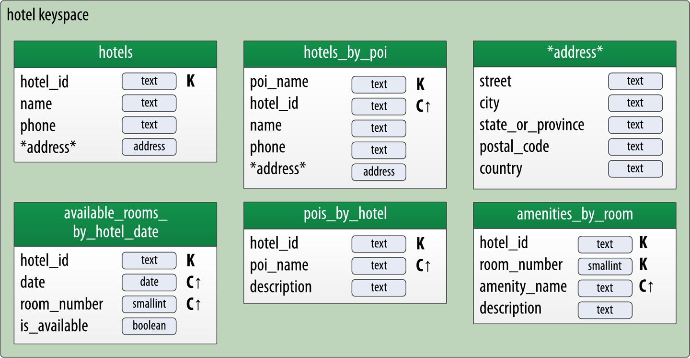

## Explorando o Cassandra e conhecendo o CQL

O CQL (Cassandra Query Language) é uma linguagem de consulta utilizada para interagir com o Cassandra. Ele fornece uma sintaxe simples e prática para criar e manipular dados no Cassandra.

### Construíndo a imagem docker do Apache Cassandra 
1. Para construir a imagem, navegue para a pasta **impacta-labs/cassandra** e execute o seguinte comando:
```bash
docker build -t impacta_labs_cassandra .
```

2. Para iniciar o container, execute o seguinte comando:
```bash
docker run -d --name cassandra-node -p 9042:9042 impacta_labs_cassandra
```

> [!WARNING]
> O container pode demorar alguns minutos para iniciar. Você pode acompanhar o progresso usando o comando `docker logs cassandra-node`.

3. Para acessar o shell do Cassandra, execute o seguinte comando:   
```bash  
docker exec -it cassandra-node cqlsh
```

### 1. Criando um Keyspace

Um *keyspace* no Cassandra é algo semelhante a um banco de dados relacional. Ele define uma ou mais tabelas. Quando você inicia o `cqlsh` sem especificar um *keyspace*, o prompt aparecerá assim: `cqlsh>`, sem nenhum *keyspace* especificado.

Agora você criará seu próprio *keyspace* para ter onde escrever os dados. Ao criar um *keyspace*, existem algumas opções obrigatórias. Para explorar essas opções, você poderia usar o comando `HELP CREATE_KEYSPACE`, mas, em vez disso, pode usar os recursos úteis de autocompletar do `cqlsh`. Execute o seguinte comando, clique em algum lugar no terminal e pressione a tecla **Tab**:

```sql
CREATE KEYSPACE impacta_keyspace WITH
```

Quando você pressiona a tecla **Tab**, o `cqlsh` começa a completar a sintaxe do comando para que fique assim:

```sql
CREATE KEYSPACE impacta_keyspace WITH replication = {'class': '
```

Isso indica que, para especificar um *keyspace*, você também precisa definir uma estratégia de replicação (*replication strategy*). Pressione **Tab** novamente para ver as opções disponíveis:

```sql
CREATE KEYSPACE impacta_keyspace WITH replication = {'class': '
NetworkTopologyStrategy  SimpleStrategy
```

Agora, o `cqlsh` está apresentando duas estratégias para escolher. Por enquanto, escolha a `SimpleStrategy`, digitando o nome, e indique que terminou com uma aspas de fechamento. Pressione **Tab** novamente:

```sql
CREATE KEYSPACE impacta_keyspace WITH replication = {'class': 'SimpleStrategy', 'replication_factor':
```

A próxima opção apresentada é o fator de replicação (*replication factor*). Para a estratégia simples (*SimpleStrategy*), isso indica quantos nós (nodes) terão os dados deste *keyspace*. Para um ambiente de produção, você desejará armazenar cópias dos seus dados em vários nós. Mas, como está usando apenas um nó no momento, peça apenas uma cópia. Especifique o valor `1`, insira um espaço e pressione **Tab** novamente (note que o espaço é obrigatório):

```sql
CREATE KEYSPACE impacta_keyspace WITH replication = {'class': 'SimpleStrategy', 'replication_factor': 1 };
```

O `cqlsh` agora adicionou um colchete de fechamento, indicando que você completou todas as opções obrigatórias. Finalize o comando com um ponto e vírgula e pressione **Enter**, e seu *keyspace* será criado.

> [!WARNING]
> Para um *keyspace* de produção, você provavelmente nunca usará o valor `1` como fator de replicação. Existem opções adicionais para criar um *keyspace*, dependendo da estratégia de replicação escolhida. O recurso de autocompletar do comando guiará você pelas diferentes opções.

Confira seu keyspace usando o comando `DESCRIBE KEYSPACE`:

```sql
DESCRIBE KEYSPACE impacta_keyspace;
```

Você verá que a tabela foi criada com `SimpleStrategy`, um `replication_factor` de 1 e com gravações duráveis (_durable writes_). Note que o keyspace é descrito com uma sintaxe muito semelhante à que você usou para criá-lo, com uma opção adicional que não foi especificada: `durable_writes = true`.

Depois de criar seu próprio keyspace, você pode alternar para ele no shell digitando:

```sql
USE impacta_keyspace;
```

> :eyes: Note que o prompt mudou para indicar que você está usando o keyspace.

> [!TIP]
>  Você pode ter se perguntado por que sugeri nomear seu keyspace em **"snake case"** (por exemplo, `impacta_keyspace`) em vez de **"camel case"** (como `MyKeyspace`), que é mais familiar para desenvolvedores que utilizam Java e outras linguagens. Acontece que o Cassandra processa automaticamente os nomes de keyspace, tabelas e colunas como **letras minúsculas**. Quando você insere nomes em letras maiúsculas e minúsculas combinadas (_mixed case_), o Cassandra os armazena como letras minúsculas. Esse comportamento pode ser sobrescrito ao envolver os nomes entre aspas duplas (por exemplo, `CREATE KEYSPACE "MyKeyspace"`). No entanto, tende a ser muito mais simples usar **snake case** do que contrariar essa convenção.

### 2. Criando uma Tabela

Agora que você tem um _keyspace_, pode criar uma tabela nele. Para fazer isso no `cqlsh`, use o seguinte comando:

```sql
CREATE TABLE user (first_name text, last_name text, title text, PRIMARY KEY (last_name, first_name));
```

Este comando cria uma nova tabela chamada `user` no seu _keyspace_ atual, com três colunas para armazenar o nome, sobrenome e um título, todos do tipo `text`.

Os tipos `text` e `varchar` são sinônimos e usados para armazenar strings. Mas qual o motivo do CQL fornece dois tipos de dados para representar texto?

- `text` e `varchar` são sinônimos para uma string de caracteres em UTF-8 (equivalente a `java.lang.String`).  
- `ascii` é para uma string de caracteres no formato ASCII.

O UTF-8 é o padrão de texto mais recente e amplamente utilizado, além de suportar a internacionalização. Por isso, recomendo usar `text` em vez de `ascii` ao construir tabelas para novos dados. O tipo `ascii` é mais útil se você estiver lidando com dados legados no formato ASCII.

Além disso, especificamos uma chave primária para esta tabela, composta pelos campos `first_name` e `last_name`, e utilizou os valores padrão para outras opções da tabela. Por enquanto, vamos considerar essa combinação de nomes como identificadora de linhas únicas na sua tabela. A coluna `title` é a única da tabela que não faz parte da chave primária.

Você pode usar o `cqlsh` para obter a descrição da tabela que acabou de criar com o comando `DESCRIBE TABLE`:

```sql
DESCRIBE TABLE user;
```

> :eyes: Você notará que o `cqlsh` imprime uma versão bem formatada do comando `CREATE TABLE` que você digitou, mas também inclui os valores padrão para todas as opções disponíveis da tabela que você não especificou.

### 3. Inserindo dados
Agora que você tem um keyspace e uma tabela, pode gravar alguns dados no banco de dados e recuperá-los. Tudo bem se, neste momento, você ainda não entender completamente o que está acontecendo. Você vai aprender o modelo de dados do Cassandra em breve. Por enquanto, você tem um _keyspace_ (banco de dados), que contém uma tabela, que por sua vez armazena colunas, a unidade atômica de armazenamento de dados.

Para gravar linhas, você usa o comando `INSERT`:

```sql
INSERT INTO user (first_name, last_name, title) VALUES ('Bill', 'Nguyen', 'Mr.');
```

### 4. Consultando dados
Agora que você inseriu alguns dados, pode lê-los usando o comando SELECT:  

```sql
SELECT * FROM user WHERE first_name='Bill' AND last_name='Nguyen';
```  

Neste comando, você solicitou o retorno das linhas que correspondem à chave primária, incluindo todas as colunas. Para essa consulta, você especificou ambas as colunas referenciadas pela chave primária. 

O que acontece quando você especifica apenas um dos valores?

```sql
SELECT * FROM user WHERE last_name = 'Nguyen';
```  

OK, isso funciona. E quanto a este? :thinking face: 

```sql
SELECT * FROM user WHERE first_name = 'Bill';
```  

Como você pode ver, você recebe uma mensagem de erro. Esse comportamento pode não parecer intuitivo à primeira vista, mas está relacionado à composição da chave primária que você usou para esta tabela. Este é o seu primeiro indício de que acessar dados no Cassandra pode ser um pouco diferente do que você está acostumado a fazer em SQL.

> [!WARNING]
> Usar `ALLOW FILTERING` não é recomendado, pois isso pode resultar em consultas muito caras. Se você se encontrar precisando de uma consulta assim, é recomendável revisar seu modelo de dados para garantir que as tabelas foram projetadas para dar suporte às suas consultas.

Você notará na última linha da saída que uma linha foi retornada. Essa linha corresponde à identificada pelo `last_name` "Nguyen" e `first_name` "Bill". Essa é a chave primária que identifica exclusivamente essa linha.

Um ponto interessante sobre a consulta acima é que ela especifica apenas a chave de partição, o que a torna uma consulta que pode potencialmente retornar várias linhas. Para ilustrar esse ponto, vamos adicionar outro usuário com o mesmo `last_name`:

```sql
INSERT INTO user (first_name, last_name, title)
  VALUES ('Wanda', 'Nguyen', 'Mrs.');
```

Em seguida, repita o comando `SELECT` anterior:

```sql
SELECT * FROM user WHERE last_name = 'Nguyen';
```

Como você pode ver, ao particionar os usuários pelo `last_name`, você torna possível carregar toda a partição em uma única consulta fornecendo apenas o `last_name`. Para acessar apenas uma única linha, você precisará especificar a chave primária completa:

```sql
SELECT * FROM user WHERE last_name='Nguyen' AND
  first_name='Bill';
```

Resumindo esse ponto importante: os comandos `SELECT`, `INSERT`, `UPDATE` e `DELETE` em CQL operam em termos de linhas. Para os comandos `INSERT` e `UPDATE`, todas as colunas da chave primária devem ser especificadas na cláusula `WHERE` para identificar a linha específica que será afetada. Já os comandos `SELECT` e `DELETE` podem operar em uma ou mais linhas dentro de uma partição, em uma partição inteira ou até mesmo em várias partições utilizando as cláusulas `WHERE` e `IN`.

Embora seja necessário fornecer um valor para cada coluna da chave primária ao adicionar uma nova linha à tabela, não é obrigatório fornecer valores para colunas que não fazem parte da chave primária. Para ilustrar isso, vamos inserir outra linha sem o campo `title`:

```sql
INSERT INTO user (first_name, last_name)
  VALUES ('Mary', 'Rodriguez');
```

Como você não definiu um valor para `title`, o valor retornado em uma consulta será `null`:

```sql
SELECT * FROM user WHERE last_name='Rodriguez';
```

Se você decidir posteriormente que também gostaria de rastrear as iniciais do nome do meio dos usuários, poderá modificar a tabela `user` com o comando `ALTER TABLE`:

```sql
ALTER TABLE user ADD middle_initial text;
```

Visualize os resultados utilizando o comando `DESCRIBE TABLE`:

```sql
DESCRIBE TABLE user;
```

Você verá que a coluna `middle_initial` foi adicionada.

Agora, vamos adicionar algumas linhas e preencher diferentes colunas para cada uma:

```sql
INSERT INTO user (first_name, middle_initial, last_name,
  title)
  VALUES ('Bill', 'S', 'Nguyen', 'Mr.');

INSERT INTO user (first_name, middle_initial, last_name,
  title)
  VALUES ('Wanda', 'R', 'Nguyen', 'Mrs.');
```

Leia os resultados:

```sql
SELECT * FROM user WHERE first_name='Bill' AND last_name='Nguyen';
```

Esse foi o resultado esperado? :thinking face:

Se você estiver acompanhando de perto, pode ter notado que ambas as instruções `INSERT` acima especificam uma linha previamente identificada exclusivamente pelas colunas da chave primária `first_name` e `last_name`. Como resultado, o Cassandra atualizou fielmente a linha indicada, e seu `SELECT` retornará apenas a linha que corresponde a essa chave primária. As duas instruções `INSERT` apenas serviram para, primeiro, definir e, depois, sobrescrever o valor de `middle_initial`.

Como o Cassandra usa um modelo de adição (append), não há diferença fundamental entre as operações de inserção e atualização. Se você inserir uma linha com a mesma chave primária de uma linha existente, a linha será substituída. Se você atualizar uma linha cuja chave primária não existe, o Cassandra a criará.

Por esse motivo, muitas vezes se diz que o Cassandra suporta `upsert`, o que significa que inserções e atualizações são tratadas da mesma forma, com uma pequena exceção relacionada a transações leves.

Muitos novos usuários do Cassandra, especialmente aqueles vindos de um contexto relacional, tendem a usar o comando `SELECT COUNT` como uma forma de garantir que os dados foram escritos. Por exemplo, você poderia usar o seguinte comando para verificar a inserção na tabela `user`:  

```sql
SELECT COUNT (*) FROM user;
```  

Observe que, ao executar este comando, o `cqlsh` retorna a contagem correta de linhas, mas também exibe um aviso. Isso acontece porque você pediu ao Cassandra para realizar uma varredura completa na tabela. Em um cluster com diversos nós e grandes volumes de dados, esse `COUNT` pode ser uma operação muito cara. Essa é uma das várias maneiras pelas quais o Cassandra tenta alertá-lo ou limitar sua capacidade de realizar operações que podem ter baixo desempenho em escala em uma arquitetura distribuída.

### 5. Alterando dados

O CQL oferece suporte aos tipos numéricos que você esperaria, incluindo números inteiros e de ponto flutuante. Esses tipos são semelhantes aos tipos padrão em Java e outras linguagens:

- **int**: Um inteiro assinado de precisão variável (equivalente a `java.math.BigInteger`).
- **float**: Um decimal de precisão variável (equivalente a `java.math.BigDecimal`).
- **bigint**: Um inteiro longo assinado de 64 bits (equivalente a um `long` em Java).
- **smallint**: Um inteiro assinado de 16 bits (equivalente a um `short` em Java).
- **tinyint**: Um inteiro assinado de 8 bits (como em Java).
- **varint**: Um inteiro assinado de precisão variável (equivalente a `java.math.BigInteger`).
- **float**: Um número de ponto flutuante de 32 bits IEEE-754 (como em Java).
- **double**: Um número de ponto flutuante de 64 bits IEEE-754 (como em Java).
- **decimal**: Um decimal de precisão variável (equivalente a `java.math.BigDecimal`).

Vamos usar o tipo `int` para adicionar uma coluna à tabela `user` (usuário) para rastrear o número de vezes que o usuário fez login:

```sql
ALTER TABLE user ADD logins int;
```

Agora você pode atualizar os registros existentes para incluir os valores de logins. Os valores numéricos são inseridos sem aspas:

```sql
UPDATE user SET logins = 1 WHERE first_name = 'Bill' AND last_name = 'Nguyen';
```

Faça uma consulta nos dados para ver como os valores aparecem:

```sql
SELECT * FROM user WHERE last_name = 'Nguyen';
```

Cassandra também fornece vários tipos para representar o tempo.

**Data e hora:** Esses tipos podem ser usados para representar uma data sem horário ou um horário do dia sem referência a uma data específica. Como você verá abaixo com o tipo `timestamp`, esses tipos suportam formatos ISO 8601.

**Timestamp:** O horário pode ser codificado como um inteiro assinado de 64 bits, mas é geralmente mais útil inserir um timestamp usando um dos vários formatos de data suportados pelo ISO 8601. Por exemplo:

- 2015-06-15 20:05-0700  
- 2015-06-15 20:05:07-0700  
- 2015-06-15 20:05:07.013-0700  
- 2015-06-15T20:05-0700  
- 2015-06-15T20:05:07-0700  
- 2015-06-15T20:05:07.013+-0700  

> [!TIP]
>  A melhor prática para esses tipos é sempre fornecer os fusos horários em vez de depender da configuração de fuso horário do sistema operacional.

Vamos usar o tipo `timestamp` para adicionar uma coluna à tabela `user` representando quando a conta foi criada:

```sql
ALTER TABLE user ADD account_created timestamp;
```

Agora você pode inserir registros incluindo a coluna `account_created`. Você pode usar os formatos listados acima:

```sql
UPDATE user SET account_created = '2024-10-05T20:05:07-0300' WHERE first_name = 'Bill' AND last_name = 'Nguyen';
```

Ou pode usar a função `currentTimestamp()` para permitir que o Cassandra defina o timestamp:

```sql
UPDATE user SET account_created = currentTimestamp() WHERE first_name = 'Bill' AND last_name = 'Nguyen';
```

Agora verifique os resultados:

```sql
SELECT * FROM user WHERE last_name = 'Nguyen';
```

O CQL também fornece funções práticas para conversão de data/hora, incluindo `toDate()`:

```sql
SELECT toDate(account_created) FROM user WHERE last_name = 'Nguyen';
```

#### Tipos Avançados

Agora, digamos que você queira estender a tabela de usuários para suportar múltiplos endereços de e-mail. Uma maneira de fazer isso seria criar colunas adicionais, como email1, email2, email3, e assim por diante. Embora essa abordagem funcione, ela não escala muito bem e pode causar muito retrabalho. É muito mais simples lidar com os endereços de e-mail como um grupo ou "coleção." O CQL fornece três tipos de coleções para ajudá-lo nessas situações: conjuntos (*sets*), listas (*lists*) e mapas (*maps*).

O tipo de dado `set` armazena uma coleção de elementos. Os elementos não têm ordem específica quando armazenados, mas são retornados em ordem ordenada. Por exemplo, valores de texto são retornados em ordem alfabética. Uma vantagem de usar *set* é a capacidade de inserir itens adicionais sem precisar ler o conteúdo antes. Além disso, os elementos de uma coleção set são únicos, não podendo haver duplicatas.

Você pode modificar a tabela de usuários para adicionar um *set* de endereços de e-mail:

```sql
ALTER TABLE user ADD emails set<text>;
```

Depois, adicione um endereço de e-mail para Mary:

```sql
UPDATE user SET emails = { 'mary@example.com' } 
WHERE first_name = 'Mary' AND last_name = 'Rodriguez';
```

Verifique se foi adicionado com sucesso:

```sql
SELECT emails FROM user WHERE first_name = 'Mary' AND last_name = 'Rodriguez';
```

Observe que, ao adicionar esse primeiro endereço de e-mail, você substituiu o conteúdo anterior do *set*, que, neste caso, era *NULL*. Você pode adicionar outro endereço de e-mail posteriormente sem substituir todo o *set* usando concatenação:

```sql
UPDATE user
  SET emails = emails + {'mary.rodriguez.AZ@gmail.com' }
  WHERE first_name = 'Mary' AND last_name = 'Rodriguez';
```

Verifique a atualização:

```sql
SELECT emails FROM user
  WHERE first_name = 'Mary' AND last_name = 'Rodriguez';
```

Você também pode remover itens do *set* usando o operador de subtração:

```sql
UPDATE user
  SET emails = emails - {'mary@example.com'}
  WHERE first_name = 'Mary' AND last_name = 'Rodriguez';
```

Alternativamente, você pode limpar todo o conteúdo do *set* usando a notação de *set* vazio:

```sql
UPDATE user
  SET emails = {}
  WHERE first_name = 'Mary' AND last_name = 'Rodriguez';
```

O tipo de dado `list` contém uma lista ordenada de elementos. Por padrão, os valores são armazenados na ordem de inserção. Você pode modificar a tabela de usuários para adicionar uma lista de números de telefone:  

```sql
ALTER TABLE user ADD phone_numbers list<text>;
```

Em seguida, adicione um número de telefone para Mary:  

```sql
UPDATE user SET phone_numbers = ['+55 (11) 91234-5678']
  WHERE first_name = 'Mary' AND last_name = 'Rodriguez';
```

Verifique se ele foi adicionado com sucesso:  

```sql
SELECT phone_numbers FROM user WHERE
  first_name = 'Mary' AND last_name = 'Rodriguez';
```

Vamos adicionar um segundo número, anexando-o:  

```sql
UPDATE user SET phone_numbers =
  phone_numbers + ['+55 (11) 5678-1234']
  WHERE first_name = 'Mary' AND last_name = 'Rodriguez';
```

Vamos verificar o resultado disso:  

```sql
SELECT phone_numbers FROM user WHERE
  first_name = 'Mary' AND last_name = 'Rodriguez';
```

O segundo número adicionado agora aparece no final da lista.  

Você também poderia ter colocado o número no início da lista invertendo a ordem dos valores:  

```sql
UPDATE user SET phone_numbers = ['+55 (12) 9678-1234'] + phone_numbers WHERE
  first_name = 'Mary' AND last_name = 'Rodriguez';
```

Você pode substituir um item individual da lista referenciando-o pelo índice:  

```sql
UPDATE user SET phone_numbers[1] = '+55 (13) 1234-5678'
  WHERE first_name = 'Mary' AND last_name = 'Rodriguez';
```

Assim como com conjuntos, você também pode usar o operador de subtração para remover itens que correspondam a um valor especificado:  

```sql
UPDATE user SET phone_numbers =
  phone_numbers - ['+55 (12) 9678-1234']
  WHERE first_name = 'Mary' AND last_name = 'Rodriguez';
```

Por fim, você pode excluir um item específico diretamente usando seu índice:  

```sql
DELETE phone_numbers[0] FROM user WHERE
  first_name = 'Mary' AND last_name = 'Rodriguez';
```

Como uma lista armazena valores de acordo com a posição, há o risco de que atualizar ou excluir um item específico exija que o Cassandra leia todo o conteúdo, execute a operação solicitada e grave todo o conteúdo novamente. Isso pode ser uma operação custosa se você tiver um grande número de valores. Por esse motivo, muitos desenvolvedores e arquitetos preferem usar os tipos conjunto (set) ou mapa (map), especialmente em casos onde há a possibilidade de atualizar o conteúdo da coleção.

O tipo de dado `map` contém uma coleção de pares chave-valor. As chaves e os valores podem ser de qualquer tipo, exceto `counter`.

> [!TIP]
>  O tipo de dado "contador" fornece um inteiro de 64 bits com sinal, cujo valor não pode ser definido diretamente, mas apenas incrementado ou decrementado. Contadores são frequentemente usados para rastrear estatísticas, como número de visualizações de páginas, tweets, mensagens de log, entre outros. O tipo de dado contador possui algumas restrições especiais como visto acima, ele também não pode ser usado como parte de uma chave primária. Caso um contador seja utilizado, todas as colunas, exceto as colunas da chave primária, devem ser contadores.

Vamos experimentar isso usando um **map** para armazenar informações sobre logins de usuários. Crie uma coluna para rastrear o tempo da sessão de login, em segundos, usando um **timeuuid** como chave:

```sql
ALTER TABLE user ADD
  login_sessions map<timeuuid, int>;
```

> [!TIP]
>  O timeuuid é um UUID do Tipo 1, que é baseado no endereço MAC do computador, no horário do sistema e em um número de sequência usado para evitar duplicados. Esse tipo é frequentemente utilizado como um carimbo de data/hora. O CQL oferece várias funções práticas para interagir com o tipo timeuuid: `now()`, `dateOf()` e `unixTimestampOf()`.

Depois, você pode adicionar algumas sessões de login para Mary:

```sql
UPDATE user SET login_sessions =
  { now(): 13, now(): 18}
  WHERE first_name = 'Mary' AND last_name = 'Rodriguez';
```

Veja os resultados:

```sql
SELECT login_sessions FROM user
  WHERE first_name = 'Mary' AND last_name = 'Rodriguez';
```

Também podemos referenciar um item individual no **map** usando sua chave.

### 6. Tempo de Vida (TTL) de um dado no Apache Cassandra
Uma funcionalidade muito poderosa que o Cassandra oferece é a capacidade de expirar dados que não são mais necessários. Essa expiração é bastante flexível e funciona no nível de valores de colunas individuais. O **time to live (TTL)** é um valor que o Cassandra armazena para cada valor de coluna, indicando por quanto tempo manter esse valor.

O valor do TTL tem como padrão `null`, o que significa que os dados escritos não expirarão. Vamos demonstrar isso adicionando a função `ttl()` a um comando `SELECT` no cqlsh para verificar o valor TTL do título de Mary:

```sql
SELECT first_name, last_name, ttl(title)
  FROM user WHERE first_name = 'Mary' AND last_name = 'Rodriguez';
```

Agora, vamos definir o TTL da coluna `last_name` para uma hora (3.600 segundos) adicionando a opção `USING TTL` ao comando `UPDATE`:

```sql
UPDATE user USING TTL 3600 SET middle_initial =
  'Z' WHERE first_name = 'Mary' AND last_name = 'Rodriguez';
```

Para verificar o valor do TTL, vamos recuperar a linha:

```sql
SELECT first_name, middle_initial,
  last_name, TTL(middle_initial)
  FROM user WHERE first_name = 'Mary' AND last_name = 'Rodriguez';
```

Como você pode ver, o contador já está diminuindo o TTL, refletindo os segundos gastos para digitar o segundo comando. Se você executar esse comando novamente após uma hora, o valor de `middle_initial` de Mary será mostrado como `null`.  

Você também pode definir o TTL em comandos `INSERT` usando a mesma opção `USING TTL`, caso em que toda a linha expirará. Tente inserir uma linha com TTL de 60 segundos:

```sql
INSERT INTO user (first_name, last_name)
  VALUES ('Jeff', 'Carpenter') USING TTL 60;
```

Verifique se a linha está presente inicialmente:

```sql
SELECT * FROM user WHERE first_name='Jeff' AND
  last_name='Carpenter';
```

Depois de esperar um minuto, a linha não estará mais lá:

```sql
SELECT * FROM user WHERE first_name='Jeff' AND
  last_name='Carpenter';
```

Lembre-se de que o TTL é armazenado no nível de colunas para colunas que não são chave primária. Atualmente, não existe um mecanismo para definir TTL no nível da linha diretamente após a inserção inicial; nesse caso, você precisaria reinserir a linha, aproveitando o comportamento de **upsert** do Cassandra. Assim como o timestamp, não há como obter ou definir o valor de TTL de uma coluna de chave primária, e o TTL pode ser definido para uma coluna apenas quando você fornecer um valor para ela.

Se você quiser definir o TTL para toda uma linha, deverá fornecer um valor para cada coluna que não seja chave primária no seu comando `INSERT` ou `UPDATE`.

### 6. Removendo dados 
Se você realmente quiser limpar as coisas, pode remover todos os dados da tabela usando o comando `TRUNCATE`:

```sql
TRUNCATE user;
```

Alternativamente, você pode excluir completamente o esquema da tabela usando o comando `DROP TABLE`:

```sql
DROP TABLE user;
```

## Modelagem de Dados no Cassandra

Ao projetar modelos de dados no Cassandra, você começa pelo modelo de consulta. Em contraste modelagem relacional, onde você primeiro modela os dados e depois escreve as consultas, no Cassandra você modela as consultas e organiza os dados em torno delas.

Pense nos caminhos de consulta mais comuns que sua aplicação usará e, em seguida, crie as tabelas necessárias para suportá-las.

> [!TIP]
>  O design da interface do usuário da aplicação costuma ser um ótimo ponto de partida para identificar as consultas.

Vamos utilizar um exemplo de uma aplicação para listar hotéis e detalhes de seus quartos. No diagrama abaixo, cada bloco representa uma etapa no _workflow_ da aplicação, com setas indicando os fluxos entre etapas e a consulta associada.


Perceba como cada etapa do _workflow_ realiza uma tarefa que "desbloqueia" as etapas subsequentes. Por exemplo, a tarefa "Visualizar hotéis próximos ao PDI (Pontos de Interesse)" ajuda a aplicação a descobrir vários hotéis, incluindo suas chaves únicas. A chave de um hotel selecionado pode ser usada como parte da consulta `C2` para obter uma descrição detalhada do hotel.

Nos passos seguintes, você examinará o design das tabelas que dão suporte às cinco primeiras consultas no diagrama, relacionadas aos pontos de interesse, hotéis e detalhes dos quartos.

```sql
CREATE KEYSPACE hotel WITH replication = {'class': 'SimpleStrategy', 'replication_factor' : 1};
```

```sql
USE hotel;
```

Os dois primeiros padrões de consulta no _workflow_ da aplicação descrevem duas formas diferentes de obter informações sobre hotéis:

**`C1`**: Encontrar hotéis próximos a um ponto de interesse específico.  

**`C2`**: Obter informações sobre um hotel específico, como seu nome e localização.  

Vamos supor que você determinou que os atributos de um hotel incluem seu `ID`, `nome`, `descrição`, `número de telefone`, `endereço` e `pontos de interesse próximos`. Note que um endereço, por si só, é um objeto mais complexo composto por campos adicionais.

Neste exemplo iremos optar por modelar isso utilizando o recurso de tipos definidos pelo usuário (UDT) do Cassandra:

```sql
CREATE TYPE hotel.address (
    street text,
    city text,
    state_or_province text,
    postal_code text,
    country text
);
```

> [!TIP]
>  Os UDTs são frequentemente usados para criar agrupamentos lógicos de colunas que não são chaves primárias. Eles também podem ser armazenados em coleções (conjuntos, listas ou mapas) para reduzir ainda mais a complexidade do design. O escopo de um UDT é no _keyspace_ no qual ele é definido.

A primeira consulta (`C1`) é para encontrar hotéis próximos a um ponto de interesse, então você chamará a tabela de `hotels_by_poi`. Você está pesquisando por um ponto de interesse, portanto seria ideal considerar o ponto de interesse como parte da chave primária. Vamos referenciar o ponto de interesse pelo nome porque, de acordo com seu _workflow_, é assim que seus usuários começarão a busca.

Observe que provavelmente haverá mais de um hotel próximo a um determinado ponto de interesse, então você precisará de outro componente na sua chave primária para garantir uma partição única para cada hotel. Vamos adicionar o identificador único do hotel como uma coluna de clusterização.

> [!WARNING]
> Uma consideração importante no design da chave primária da tabela é garantir que ela defina um elemento de dado único. Caso contrário, corre-se o risco de sobrescrever dados acidentalmente.

Vamos também assumir que, de acordo com o _workflow_ do seu aplicativo, seu usuário fornecerá o nome de um ponto de interesse, mas seria útil visualizar a descrição desse ponto de interesse juntamente com os resultados dos hotéis. Portanto, você inclui a `poi_description` como uma coluna na tabela `hotels_by_poi` e atribui um valor fixo em uma coluna estática, já que a descrição do ponto de interesse é a mesma para todas as linhas de uma partição.

Você pode criar esta tabela usando o seguinte comando no `cqlsh`:

```sql
CREATE TABLE hotels_by_poi (
    poi_name text,
    poi_description text STATIC,
    hotel_id text,
    name text,
    phone text,
    address frozen<address>,
    PRIMARY KEY ((poi_name), hotel_id)
) 
WITH CLUSTERING ORDER BY (hotel_id ASC);
```

> [!TIP]
>  Quando você usa o atributo `frozen` no Cassandra, está dizendo que o valor do campo será tratado como um único bloco atômico. Isso significa que ele será armazenado e recuperado como uma unidade indivisível.
O Cassandra não permite que você atualize partes de um UDT diretamente. Assim, ao armazenar o endereço no formato `frozen`, qualquer atualização nele exige a substituição do UDT inteiro.

Assumindo o uso de um sistema de códigos curtos para os valores de `hotel_id` (como é comum na indústria de hoteleira), você poderia inserir linhas de dados representando hotéis próximos a um ponto de interesse como segue:

```sql
INSERT INTO hotels_by_poi (poi_name, poi_description, hotel_id, name, phone, address) VALUES (
  'Hípica Nacional', 
  'Local para eventos equestres', 
  'SP001', 
  'Hotel Fazenda Hípica Nacional',
  '+55 11 99999-9999', 
  { street: 'Estrada dos Tropeiros, 123', 
    city: 'Campos do Jordão', 
    state_or_province: 'SP', 
    postal_code: '12460-000', 
    country: 'Brasil' }
);
```

Para recuperar linhas próximas a um ponto de interesse específico, você usaria uma consulta como esta:

```sql
SELECT * FROM hotels_by_poi WHERE poi_name = 'Hípica Nacional';
```
 
Para conseguir responder a segunda pergunta, você precisará de uma tabela que retorne informações sobre um hotel específico. Uma abordagem seria colocar todos os atributos de um hotel na tabela `hotels_by_poi`, por uma questão organizacional optaremos por adicionar apenas os atributos necessários para o _workflow_ da aplicação.

A tabela `hotels_by_poi` é usada para exibir uma lista de hotéis com informações básicas sobre cada hotel, e a aplicação conhece os identificadores únicos dos hotéis retornados. Quando o usuário seleciona um hotel para ver detalhes, você pode então usar a consulta `C2`, que é usada para obter os detalhes do hotel. Como você já tem o `hotel_id` da consulta `C1`, iremos reutilizar isso como referência para o hotel que estamos procurando. Portanto, a segunda tabela é simplesmente chamada `hotels`:

```sql
CREATE TABLE hotels (
    id text PRIMARY KEY,
    name text,
    phone text,
    address frozen<address>,
    pois set<text>
);
```

> [!TIP]
>  Outra opção seria armazenar um conjunto de `poi_names` na tabela `hotels`. Essa é uma abordagem igualmente válida.

Você pode inserir linhas de dados representando os mesmos hotéis da etapa anterior da seguinte forma:

```sql
INSERT INTO hotels (id, name, phone, address, pois) VALUES (
  'SP001', 
  'Hotel Fazenda Hípica Nacional',
  '+55 11 99999-9999',
  { street: 'Estrada dos Tropeiros, 123', 
    city: 'Campos do Jordão', 
    state_or_province: 'SP', 
    postal_code: '12460-000', 
    country: 'Brasil' },
  { 'Hípica Nacional', 'Museu Zoologico' }
);
```

Observe que esta tabela foi projetada para dar suporte às etapas do _workflow_ da aplicação quando você sabe o ID de um hotel específico, permitindo carregar a linha correspondente da seguinte forma:

```sql
SELECT * FROM hotels WHERE id = 'SP001';
```

A consulta `C3` é apenas o inverso da `C1` — buscando pontos de interesse próximos a um hotel, em vez de hotéis próximos a um ponto de interesse. Desta vez, no entanto, você precisa acessar os detalhes de cada ponto de interesse, conforme representado pela tabela `pois_by_hotel`. Assim como antes, adicione o nome do ponto de interesse como uma chave de cluster para garantir a exclusividade:

```sql
CREATE TABLE pois_by_hotel (
    poi_name text,
    hotel_id text,
    description text,
    PRIMARY KEY ((hotel_id), poi_name)
);
```

Com o tempo, você pode atribuir diferentes pontos de interesse a um hotel:

```sql
INSERT INTO pois_by_hotel (hotel_id, poi_name, description)  VALUES (
  'SP001', 
  'Hípica Nacional',
  'Local para eventos equestres' 
);

INSERT INTO pois_by_hotel (hotel_id, poi_name, description)  VALUES (
  'SP001', 
  'Museu Zoologico',
  'Museu de Zoologia da cidade de Campos do Jordão' 
);
```

Você pode recuperar essas informações em uma única consulta:

```sql
SELECT * FROM pois_by_hotel WHERE hotel_id = 'SP001';
```

`C4`: Encontrar um quarto disponível em um intervalo de datas.

Agora vamos considerar como oferecer suporte aos usuários para encontrar quartos disponíveis em um hotel selecionado para os dias em que desejam se hospedar. Observe que essa consulta envolve tanto uma data de início quanto uma data de fim. Como você está consultando um intervalo em vez de uma única data, sabe que precisará usar a data como uma chave de agrupamento. Use colunas de agrupamento para armazenar os atributos que você precisa acessar em uma consulta por intervalo.

> [!WARNING]
> Lembre-se de que a ordem das colunas de agrupamento é importante.

Você utiliza o `hotel_id` como chave primária para agrupar os dados dos quartos de cada hotel em uma única partição, o que deve tornar sua busca super rápida. Vamos chamar essa tabela de `available_rooms_by_hotel_date`.

```sql
CREATE TABLE available_rooms_by_hotel_date (
    hotel_id text,
    date date,
    room_number smallint,
    is_available boolean,
    PRIMARY KEY ((hotel_id), date, room_number)
);
```

O design da tabela `available_rooms_by_hotel_date` é um exemplo do padrão de partição ampla (_wide partition pattern_). Esse padrão às vezes é chamado de padrão de linha ampla (_wide row pattern_) ao discutir bancos de dados que suportam modelos semelhantes, mas partição ampla é uma descrição mais precisa do ponto de vista do Cassandra. A essência do padrão é agrupar várias linhas relacionadas em uma partição para oferecer acesso rápido a várias linhas dentro da partição em uma única consulta.

Vamos usar o comando `COPY` para importar alguns dados de um arquivo:

```sql
COPY available_rooms_by_hotel_date FROM '/available_rooms.csv' WITH HEADER=true;
```

Essa tabela pode suportar consultas flexíveis. Primeiro, como a chave de partição é `hotel_id`, você pode recuperar todas as linhas de um hotel específico em várias datas:

```sql
SELECT * FROM available_rooms_by_hotel_date WHERE hotel_id = 'SP001';
```

Você pode recuperar a disponibilidade de quartos para um hotel específico e uma data, ou para um intervalo de datas, porque `date` é a primeira coluna de agrupamento:

```sql
SELECT * FROM available_rooms_by_hotel_date WHERE hotel_id = 'SP001' 
  AND date = '2024-10-01';

SELECT * FROM available_rooms_by_hotel_date WHERE hotel_id = 'SP001'
  AND date >= '2024-10-01' AND date <= '2024-10-04';
```

Finalmente, você pode verificar a disponibilidade de um quarto específico em uma data específica:

```sql
SELECT * FROM available_rooms_by_hotel_date WHERE hotel_id = 'SP001'
   AND date = '2024-10-01' AND room_number = 101;
```

**`C5`**: Encontre as comodidades de um quarto.

Para completar a parte de busca do seu modelo de dados, adicione a tabela `amenities_by_room` para dar suporte à `C5`. Isso permitirá que seu usuário visualize as comodidades de um dos quartos disponíveis para as datas desejadas da estadia:

```sql
CREATE TABLE amenities_by_room (
    hotel_id text,
    room_number smallint,
    amenity_name text,
    description text,
    PRIMARY KEY ((hotel_id, room_number), amenity_name)
);
```

Você pode fornecer várias comodidades para um quarto de hotel:

```sql
INSERT INTO amenities_by_room (hotel_id, room_number, amenity_name, description)  VALUES (
  'SP001', 
  101,
  'Máquina de café',
  'Máquina de café para porções individuais' 
);
```

```sql
INSERT INTO amenities_by_room (hotel_id, room_number, amenity_name, description)  VALUES (
  'SP001', 
  101,
  'Televisão',
  'Smart TV de alta definição' 
);
```

Você pode recuperar as comodidades de um quarto com uma única consulta. Note que, como há dois elementos na chave de partição (`hotel_id` e `room_number`), ambos devem ser fornecidos:

```sql
SELECT * FROM amenities_by_room WHERE hotel_id = 'SP001' AND room_number = 101;
```

Aqui está um diagrama que representa o design das tabelas que você criou como um modelo de dados físico:

```sql
DESCRIBE TABLES;
````



Parabéns você chegou ao final do lab! Nele espero que tenha aprendido como criar um modelo de dados Cassandra completo e funcional e a comperação com um modelo relacional equivalente.