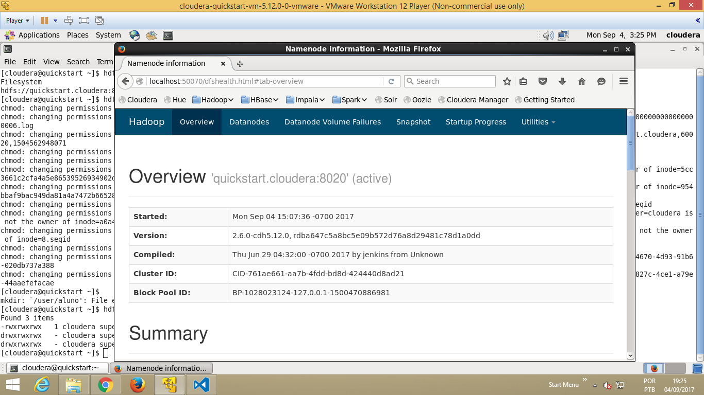
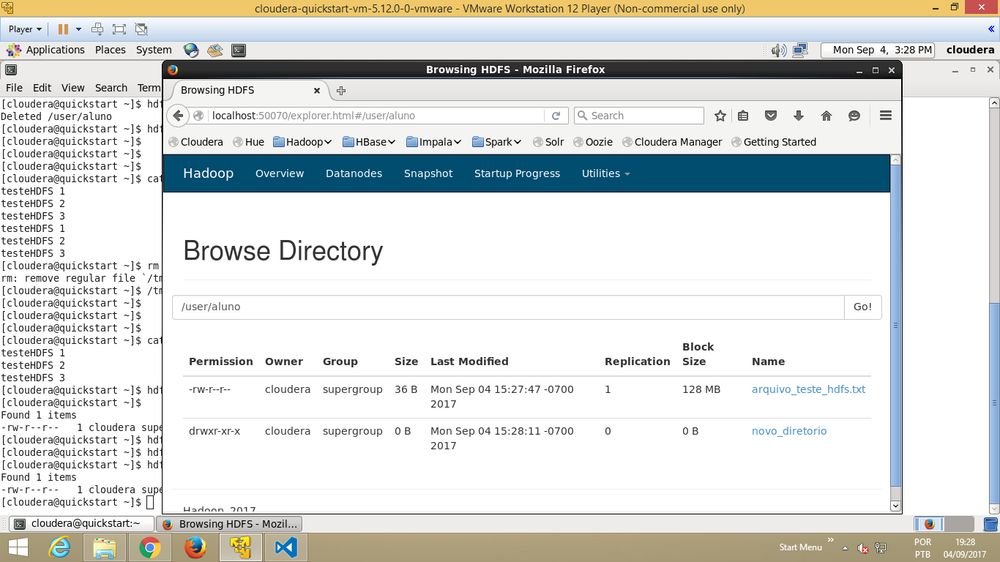
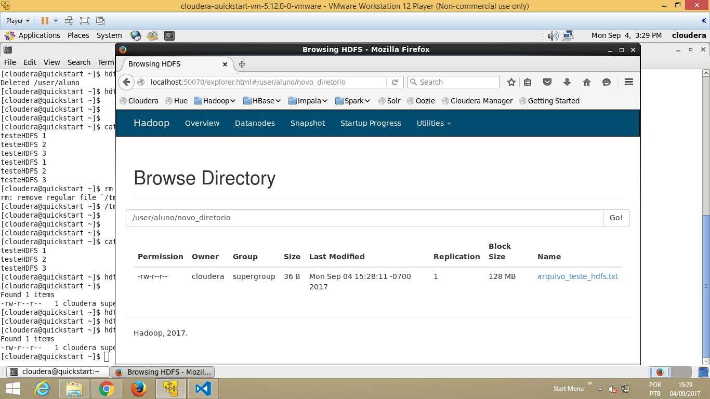
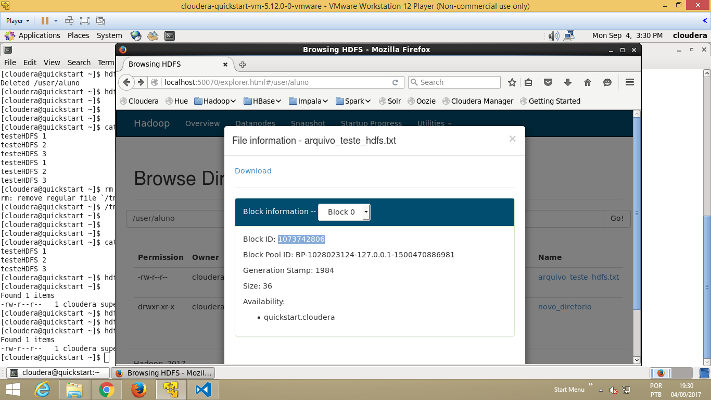

## Introdução

O HDFS possui uma arquitetura principal/operário, onde o NameNode é o principal e os DataNodes são os operários. O NameNode é responsável por armazenar os metadados do sistema de arquivos, enquanto os DataNodes armazenam os dados reais. O HDFS divide os arquivos em blocos e distribui esses blocos entre os DataNodes, garantindo alta disponibilidade e tolerância a falhas.

**Objetivo**

Neste exercício iremos analisar como o HDFS realiza a distribuição e armazenamento dos dados nos DataNodes.

**Tempo estimado**

30 minutos

**Roteiro de atividades**

**A)** Criar um diretório no HDFS  
**B)** Carregar um arquivo no diretório criado  
**C)** Verificar os IDs dos blocos dos arquivos e seus DataNodes  
**D)** Verificar como o arquivo é armazenado no linux  

----------

## Atividades

### Iniciar a VM

 - Dê dois cliques no arquivo `cloudera-quickstart-vm-5.12.0-0-vmware.vmx`
 - Esperar 5 minutos

### A) Criar um diretório no HDFS

1. Em um terminal Linux, execute o comando para verificar qual é o espaço disponível no HDFS
   ```shell
   hdfs dfs -df -h /
   ```

- **Saída esperada**:
   ```
   Filesystem                         Size     Used  Available  Use%
   hdfs://quickstart.cloudera:8020  54.5 G  829.1 M     42.8 G    1%
   ```

2. Crie um diretório com o seu nome no HDFS
   ```shell
   sudo su
   su - hdfs
   hdfs dfs -chmod -R 777 /
   hdfs dfs -mkdir /user/aluno/
   exit
   exit
   ```

3. Verifique se o diretório foi criado com sucesso no HDFS
   ```shell
   hdfs dfs -ls /user
   ```
- **Saída esperada**:
   ```
   Found 9 items
   drwxr-xr-x   - cloudera supergroup          0 2017-09-04 12:53 /user/aluno
   drwxrwxrwx   - cloudera cloudera            0 2017-07-19 06:28 /user/cloudera
   drwxrwxrwx   - mapred   hadoop              0 2017-07-19 06:29 /user/history
   drwxrwxrwx   - hive     supergroup          0 2017-07-19 06:31 /user/hive
   drwxrwxrwx   - hue      supergroup          0 2017-07-19 06:30 /user/hue
   drwxrwxrwx   - jenkins  supergroup          0 2017-07-19 06:29 /user/jenkins
   drwxrwxrwx   - oozie    supergroup          0 2017-07-19 06:30 /user/oozie
   drwxrwxrwx   - root     supergroup          0 2017-07-19 06:29 /user/root
   drwxrwxrwx   - hdfs     supergroup          0 2017-07-19 06:31 /user/spark
   ```

### B) Carregar um arquivo no diretório criado  

4. Crie um arquivo de teste no Linux
   ```shell
   echo "testeHDFS 1" >> /tmp/arquivo_teste_hdfs.txt
   echo "testeHDFS 2" >> /tmp/arquivo_teste_hdfs.txt
   echo "testeHDFS 3" >> /tmp/arquivo_teste_hdfs.txt
   ```

5. Verifique se o conteúdo do arquivo está correto
   ```shell
   cat /tmp/arquivo_teste_hdfs.txt
   ```

- **Saída esperada**:
   ```
   testeHDFS 1
   testeHDFS 2
   testeHDFS 3
   ```

6. Copie o arquivo criado para o HDFS
   ```shell
   hdfs dfs -copyFromLocal /tmp/arquivo_teste_hdfs.txt /user/aluno/
   ```

7. Verifique se o arquivo foi transferido com sucesso para o HDFS
   ```shell
   hdfs dfs -ls /user/aluno/
   ```

- **Saída esperada**:
   ```
   Found 1 items
   -rw-r--r--   1 cloudera supergroup         36 2017-09-04 12:56 /user/aluno/arquivo_teste_hdfs.txt
   ```

8. Crie um novo subdiretório dentro da sua pasta aluno
   ```shell
   hdfs dfs -mkdir /user/aluno/novo_diretorio
   ```

9. Faça uma cópia do `arquivo_teste_hdfs.txt` que já está no HDFS para esse novo diretório
  ```shell
  hdfs dfs -cp /user/aluno/arquivo_teste_hdfs.txt /user/aluno/novo_diretorio
  ```

10. Verifique se o arquivo foi copiado com sucesso
  ```shell
  hdfs dfs -ls /user/aluno/novo_diretorio
  ```

- **Saída esperada**:
  ```
  Found 1 items
  -rw-r--r--   1 cloudera supergroup         36 2017-09-04 13:00 /user/aluno/novo_diretorio/arquivo_teste_hdfs.txt
  ```

### C) Verificar os IDs dos blocos dos arquivos e seus DataNodes  

11. Acesse a interface web do NameNode apontando seu navegador para `http://localhost:50070`

   

12. Navegue até o diretório `/user/aluno`
   - Clique em Utilities > Browse the file system
   - Selecione o diretório user > aluno

   

13. Verifique que as permissões e tamanho do arquivo são iguais ao arquivo original
   - Observe as colunas do arquivo `arquivo_teste_hdfs.txt`
   - Clique em `novo_diretorio`
   - Note que para o arquivo copiado, todas as informações são iguais exceto que a data de última modificação é um pouco mais recente.

   

14. Verifique que esse arquivo possui apenas um bloco identificado por um Block ID

   

15. Copie o Block ID para um bloco de notas para uso futuro


### D) Verificar como o arquivo é armazenado no linux

16. Num terminal linux, execute o comando `find` abaixo substituindo pelo Block ID anotado na atividade anterior
   ```shell
   sudo find / -name *1073742757*
   ```

- **Saída esperada**:
   ```
   ./var/lib/hadoop-hdfs/cache/hdfs/dfs/data/current/BP-1028023124-127.0.0.1-1500470886981/current/finalized/subdir0/subdir3/blk_1073742757
   ./var/lib/hadoop-hdfs/cache/hdfs/dfs/data/current/BP-1028023124-127.0.0.1-1500470886981/current/finalized/subdir0/subdir3/blk_1073742757_1933.meta
   ```
   O arquivo que termina com `.meta` contém informações internas do HDFS. Já o que termina em `blk_...` é o caminho onde o arquivo `/home/user/arquivo_teste_hdfs.txt` do HDFS encontra-se fisicamente armazenado no linux, ***copie este path***.

17. Utilize o path copiado acima para visualizar o conteúdo do arquivo do bloco do HDFS
   ```shell
   sudo cat /var/lib/hadoop-hdfs/cache/hdfs/dfs/data/current/BP-1028023124-127.0.0.1-1500470886981/current/finalized/subdir0/subdir3/blk_1073742757
   ```

- **Saída esperada**:
   ```
   testeHDFS 1
   testeHDFS 2
   testeHDFS 3
   ```
   Note que o conteúdo desse arquivo é o mesmo do conteúdo original carregado no HDFS. É dessa forma que o HDFS armazena os dados, nos outros DataNodes onde há replica desse arquivo também haverá uma cópia local no Linux

18. Realize o mesmo procedimento de identificar o Block ID e acessar o conteúdo do arquivo no linux para a cópia desse arquivo no diretório HDFS `/user/aluno/novo_diretorio`.

19. Num terminal linux, remova a pasta `/user/aluno` e o seu conteúdo do HDFS
   ```shell
   hdfs dfs -rm -r /user/aluno/
   ```

- **Saída esperada**:
   ```
   Deleted /user/aluno
   ```

## Desafios

Já terminou o exercício? Quer um desafio maior? Então quero ver você resolver...

1. Listar o conteúdo da pasta `/user/aluno` usando o WebHDFS

2. Inserir um arquivo via chamada HTTP usando o WebHDFS Rest API

> [!TIP]
> Use o curl (https://curl.se/)