# Introdução

O _Apache Hive_ é um sistema de data warehouse construído sobre o Hadoop que permite consultas e análise de grandes conjuntos de dados armazenados no HDFS. O Hive fornece uma interface semelhante ao SQL chamada [**HiveQL**](https://hive.apache.org/docs/latest/languagemanual_27362030/), que permite aos usuários consultar dados em Hadoop sem precisar escrever código MapReduce.

Seus principais componentes são o _Hive Metastore_, que armazena os metadados das tabelas e partições, e o _Hive Driver_, que executa as consultas HiveQL.

## Objetivo

Neste exercício, iremos explorar diversas funcionalidades do Hive para gestão de um Data Warehouse utilizando o ecossistema Hadoop.

### Tempo estimado

:hourglass_flowing_sand: 60 minutos

### Roteiro de atividades

- **A)** Conhecendo o _Hue_ e seu editor Hive
- **B)** Modelar uma base de dados no Hive
- **C)** Inserir dados na base de dados manualmente
- **D)** Inserir dados em lote no Hive
- **E)** Conhecer e explorar o _metastore_ do Hive
- **F)** Consultas na base de dados  
- **G)**: Desafio

---
# Atividades

### Contextualização

Neste exercício, iremos modelar uma base de dados de compras com cartão de crédito e explorar os dados contidos nela.

## Iniciar a VM

> Para importar a máquina virtual no [VirtualBox](https://www.virtualbox.org/wiki/Downloads) é necessário instalar também o pacote de extensão.
- Após instalar o VirtualBox, basta selecionar e clicar duas vezes no arquivo `cloudera-quickstart-vm-5.13.0-0-virtualbox.ovf`.
  - O processo de importação pode demorar alguns minutos, pois a máquina virtual é grande (cerca de 5 GB).

- Antes de inicializar a máquina virtual, certifique-se de ter habilitado a opção de rede `Bridged Adapter` para que a máquina virtual tenha acesso à internet e possa ser acessada pela sua máquina.
  - Clique com o botão direito do mouse na máquina virtual e selecione `Configurações` > `Rede` > `Adaptador 1` > `Conectado a` > `Placa em modo Bridge`.

- Clique em `OK` para salvar as alteraçõe e inicie a máquina virtual clicando com o botão direito do mouse e selecionando `Iniciar`.

## A) Conhecendo o Hue e seu editor Hive

1. Utilizando o seu navegador de preferência, insira a URL do Hue `http://{ip_address}:8888` e faça login.

> [!NOTE]
> Caso esteja utilizando o navegador da própria máquina virtual, abra o navegador de internet e clique no segundo item da barra de favoritos (Hue).  

  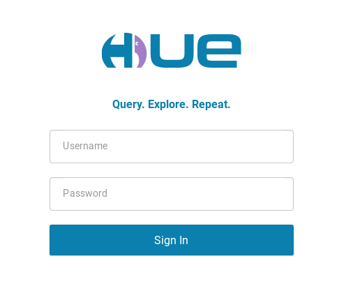  
  > Utilize as credenciais (user: `cloudera`, password: `cloudera`).

2. Explore um pouco a interface. O Hue é um portal de acesso a muitas outras ferramentas do cluster Hadoop.

3. Abra o editor de _queries_ Hive:  
  - No botão azul escrito `Query`, clique na seta ao lado e navegue em `Editor` > `Hive`.

    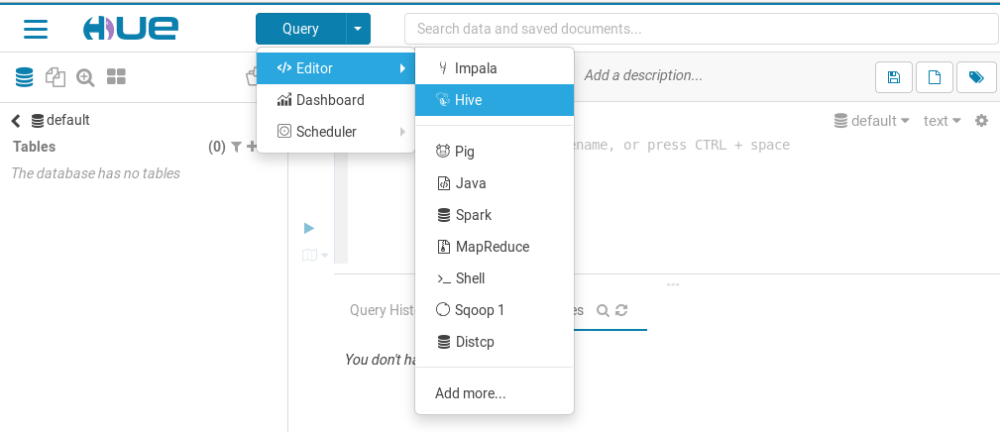  

  - Esta é uma interface web prática para execução de queries Hive, que simula outros editores de SQL como o _MySQL Workbench_.
  - Você também pode utilizar a linha de comando para as operações no Hive, executando o seguinte comando em um terminal Linux:
    ```shell
    hive
    ```

    **Saída esperada:**
    ```shell
    Logging initialized using configuration in file:/etc/hive/conf.dist/hive-log4j.properties
    WARNING: Hive CLI is deprecated and migration to Beeline is recommended.
    hive>
    ```

## B) Modelar uma base de dados Hive

4. Liste os bancos de dados disponíveis:
  - Em um editor de queries Hive, execute:
    ```sql
    show databases;
    ```

    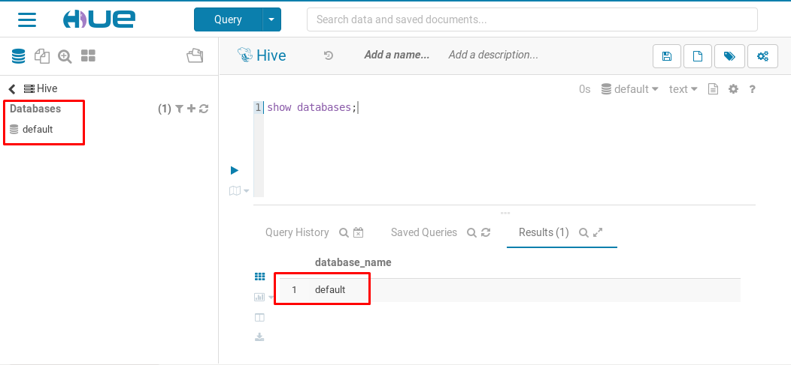

> [!NOTE]
> Os metadados dos bancos de dados estão sempre visíveis na barra lateral.

5. Crie o banco de dados `credit_card`:  
  - Execute a query Hive abaixo:  
    ```sql
    create database if not exists credit_card location '/db/credit_card';
    ```
> [!IMPORTANT]
> Por padrão, o Hive armazena os dados no HDFS na pasta `/user/hive/warehouse`, mas neste exercício iremos armazenar os dados em uma pasta diferente, `/db/credit_card`.

  - Verifique que o banco de dados foi criado com sucesso:  
    ```sql
    use credit_card;
    ```

6. Crie a tabela de dados de transações de cartão de crédito:  
  - Execute a query Hive abaixo:  
    ```sql
    create external table credit_card.transactions (
     ts string,
     card_id string,
     store string,
     status string,
     currency string,
     amount bigint
    )
    partitioned by (dt bigint)
    row format delimited fields terminated by '|'
    collection items terminated by ','
    stored as textfile
    location '/db/credit_card/transactions';
    ```

> [!NOTE] 
> - A tabela `credit_card.transactions` é uma tabela externa, ou seja, os dados não são armazenados no Hive, mas sim no HDFS.  
> - A tabela é particionada pela coluna `dt`, que representa a data da transação.  
> - A tabela é armazenada no formato de texto delimitado por pipe (`|`).

7. Verifique no menu `Databases` lateral que o novo `schema` foi criado com os novos metadados:  
  - Clique no ícone de refresh (seta circular) para atualizar a lista de bancos de dados, caso necessário.  
  - Por fim, selecione `credit_card` > `transactions`.  
    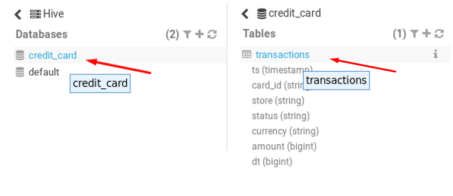

## C) Inserir dados na base de dados manualmente

8. Abra a pasta configurada para a tabela `transactions` no HDFS:  
  - Clique no menu hamburguinho no canto superior esquerdo e então em `Files`.  
    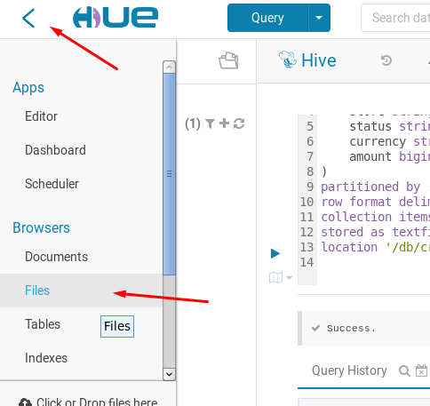  
  - Navegue pela estrutura de pastas até `/db/credit_card/transactions`.  
  - Verifique que ela está vazia.  
    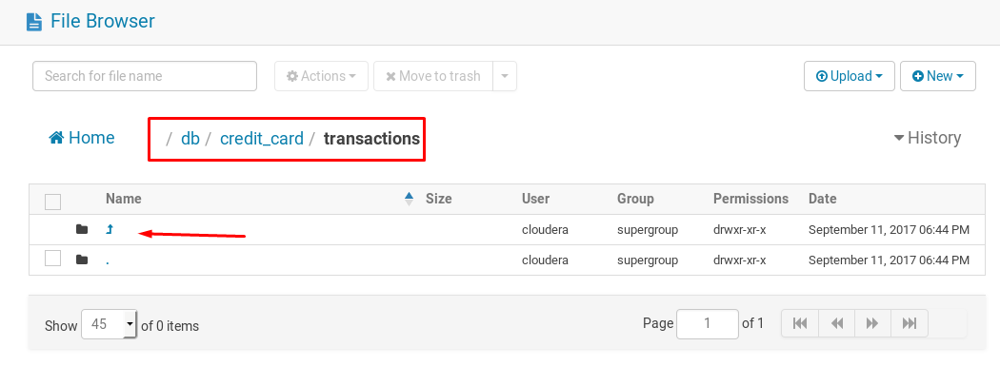

9. Crie uma partição para a tabela:  
  - Abra um editor Hive em outra aba.  
  - Execute o comando abaixo para adicionar uma partição:  
    ```sql
    alter table credit_card.transactions add partition (dt=20170912);
    ```
  - Atualize a visão do navegador de arquivos e verifique que uma nova pasta de partição foi criada.  
    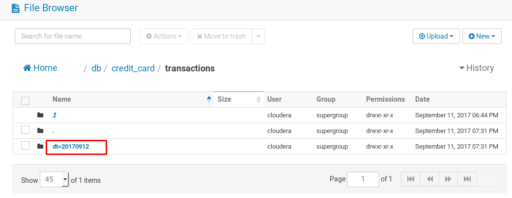

10. Criando um novo arquivo usando o Hue:  
   - Dê dois cliques para entrar na pasta da partição `dt=20170912`.  
   - Crie um novo arquivo clicando em `New` > `File`.  
    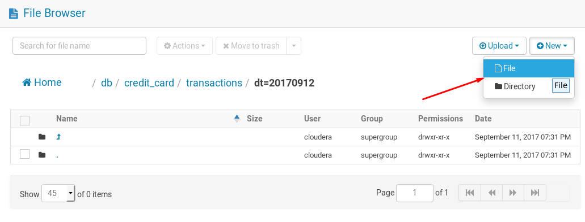  
   - Escolha um nome qualquer para ele e clique em `Create`.  
    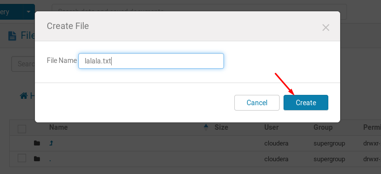

11. Insira no conteúdo do arquivo uma linha no formato esperado:  
  - Clique no nome do arquivo para editá-lo.  
  - Clique em `Edit File`.  
  - Insira o conteúdo a seguir:
  ```
  2017-09-12 01:23:45|a1b2c3d4|Casas Bahia|APROVADA|BRL|19990
  ```
  
  **Saída esperada:**  
  

12. Recupere os dados da tabela de transações:  
  - Em um editor Hive, execute:  
    ```sql
    select * from credit_card.transactions;
    ```

  **Saída esperada:**  
  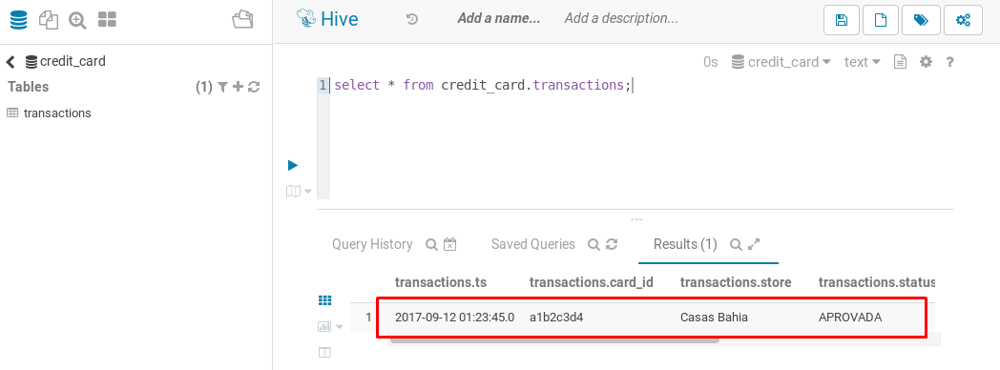

13. Outra maneira de inserir dados é através do próprio comando SQL:  
  - Em um editor Hive, execute:  
    ```sql
    insert into table credit_card.transactions partition (dt=20170101)
      values ("2017-01-01 01:23:45","e5f6g7h8","Americanas","APROVADA","BRL",5000);
    ```
  - Verifique que uma nova partição foi criada em `/db/credit_card/transactions`.  
  - Verifique que o novo registro é retornado na query abaixo:  
    ```sql
    select * from credit_card.transactions;
    ```

## D) Inserir dados em lote

14. Baixe o arquivo contido neste repositório para popular a tabela.

15. Faça o upload do arquivo para o HDFS:
  - Vá para a home do usuário cloudera clicando no ícone da casa.  
  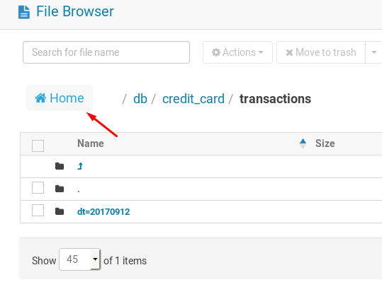  
  - Crie uma nova pasta com nome `importacao_20170912` e entre nela.  
  - Clique em `Upload` > `File` para enviar um novo arquivo para o HDFS.  
  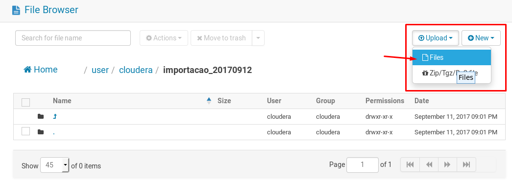  
  - Verifique que o arquivo agora é listado.  
  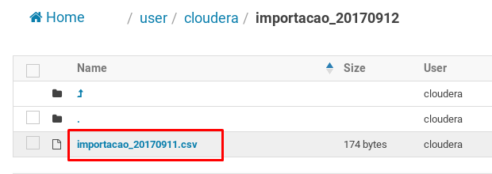

16. Crie uma tabela de stage temporária com o formato do arquivo CSV:  
  - Em um editor Hive, execute:  
  ```sql
  create table credit_card.transactions_stage (
      ts timestamp,
      card_id string,
      store string,
      status string,
      currency string,
      amount bigint
  )
  row format delimited fields terminated by ','
  stored as textfile
  location '/user/cloudera/importacao_20170912';
  ```
  - Verifique que há dados nessa tabela:  
```sql
select * from credit_card.transactions_stage limit 10;
```

  **Saída esperada:**  
  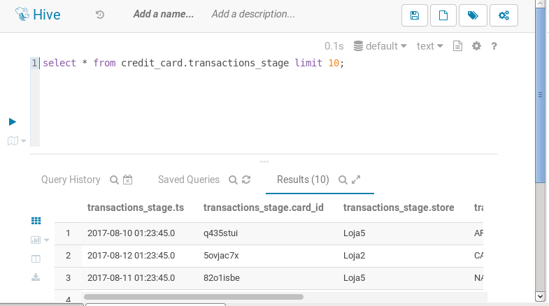

17. Faça a importação de dados em lote a partir da tabela de stage:  
  - Em um editor Hive, execute:  
  ```sql
  set hive.exec.dynamic.partition.mode=nonstrict;

  from credit_card.transactions_stage stg
  insert into table credit_card.transactions partition(dt)
  select stg.ts, stg.card_id, stg.store, stg.status, stg.currency, stg.amount,
      cast(from_unixtime(unix_timestamp(stg.ts), 'YYYYmmdd') as bigint);
  ```
  - Aguarde o término de execução da consulta (pode levar alguns minutos).  
  - Verifique que diversas partições foram criadas.  
  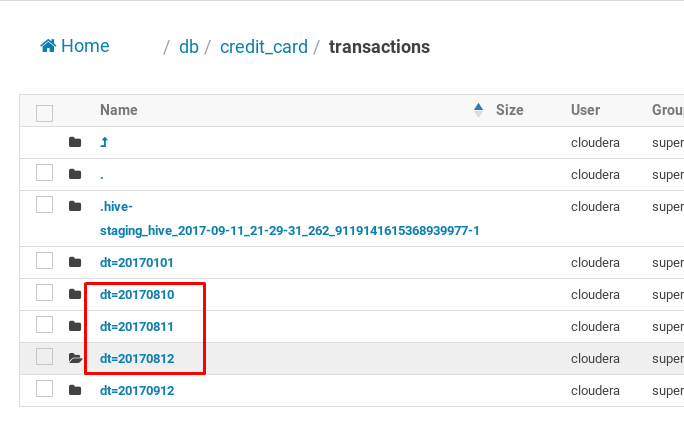

  - Verifique que vários outros registros aparecem na consulta:  
  ```sql
  select * from credit_card.transactions;
  ```

## E) Conhecer e explorar o metastore do Hive, acessando o MySQL

18. Abra uma sessão no MySQL:  
  - Em um terminal Linux, execute o comando abaixo:  
  ```shell
  mysql -u root -p
  ```
  - Quando solicitado, utilize a senha `cloudera`.

19. Visualize a estrutura do metastore:  
   ```sql
   use metastore;
   show tables;
   ```
   **Saída esperada:**  
   ```shell
   +---------------------------+
   | Tables_in_metastore       |
   +---------------------------+
   | BUCKETING_COLS            |
   | CDS                       |
   | COLUMNS_V2                |
   ...
   | TYPES                     |
   | TYPE_FIELDS               |
   | VERSION                   |
   +---------------------------+
   54 rows in set (0.00 sec)
   ```

20. Visualize o controle das tabelas do Hive:  
   ```sql
   select * from TBLS;
   ```
   **Saída esperada:**  
   ```
   +--------+-------+----------+-----------+--------------------+----------------+- ...
   | TBL_ID | DB_ID | OWNER    | RETENTION | TBL_NAME           | TBL_TYPE       |  ...
   +--------+-------+----------+-----------+--------------------+----------------+- ...
   |      4 |     3 | cloudera |         0 | transactions       | EXTERNAL_TABLE |  ...
   |      7 |     3 | cloudera |         0 | transactions_stage | MANAGED_TABLE  |  ...
   +--------+-------+----------+-----------+--------------------+----------------+- ...
   2 rows in set (0.00 sec)
   ```

21. Visualize o controle das partições do Hive:  
   ```sql
   select * from PARTITIONS;
   ```
   **Saída esperada:**  
   ```
   +---------+-------------+------------------+-------------+- ...
   | PART_ID | CREATE_TIME | LAST_ACCESS_TIME | PART_NAME   |  ...
   +---------+-------------+------------------+-------------+- ...
   |       3 |  1505183474 |                0 | dt=20170912 |  ...
   |       5 |  1505188424 |                0 | dt=20170101 |  ...
   |       9 |  1505190690 |                0 | dt=20170811 |  ...
   |      10 |  1505190691 |                0 | dt=20170812 |  ...
   |      11 |  1505190691 |                0 | dt=20170810 |  ...
   +---------+-------------+------------------+-------------+- ...
   4 rows in set (0.00 sec)
   ```

## F) Consultar a base de dados

22. Faça algumas consultas utilizando agregação:  
   - Em um editor Hive, realize algumas consultas utilizando agregação:  
  ```sql
  select dt, count(1) from credit_card.transactions group by dt;
  ```

  **Saída esperada:**  
  ```
  20170101  1
  20170912  1
  20170810  33449
  20170811  33129
  20170812  33422
  ```

  - Experimente algumas outras consultas, por exemplo:  
  ```sql
  -- quantidade de dinheiro perdido por problemas técnicos
  select sum(amount) from credit_card.transactions where status = 'CANCELADA';

  -- desempenho de cada estabelecimento em um determinado dia
  select store, count(1), sum(amount) from credit_card.transactions where dt=20170811 group by store;
  ```

---

# Desafio

Quer um desafio maior?

1. **Faça uma tabela que funcione utilizando _regex SerDe_:**  
  - Crie uma tabela chamada `credit_card.transactions_log_raw` com as mesmas colunas da `credit_card.transactions`.  
  - Insira o único registro abaixo manualmente (como na atividade C):  
    ```
    [ 2017-09-12 01:23:45 ] Accepted Transaction Data
    - APROVADA - {"cartao":"a1b2c3d4", "loja":
    "Casas Bahia", "moeda":"BRL", "valor": 19990}
    ```
  - Desenvolva um `create table` utilizando _Regex SerDe_ que seja capaz de ler o conteúdo acima.  
  - O comando `select * from credit_card.transactions_log_raw` deve retornar com sucesso o resultado:  
    ```
    2017-09-12 01:23:45|a1b2c3d4|Casas Bahia|APROVADA|BRL|19990
    ```

2. **Crie uma tabela com o formato Parquet e compressão GZip:**  
  - Crie uma tabela com o mesmo conteúdo da `credit_card.transactions`, mas com o formato Parquet e compressão GZip.  
    - [Referência: Hive Parquet](https://hive.apache.org/docs/latest/parquet_38570914/)  
    - [Referência: Hive Compression](https://hive.apache.org/docs/latest/compressedstorage_27362073/)  
  - Insira alguns registros por meio de um `insert into ...`.  
  - Navegue pela estrutura de arquivos do HDFS e verifique como estão materializados os arquivos.  
  - Faça uma consulta e verifique se o Hive consegue ler os dados:  
    ```sql
    select * from credit_card.transactions_parquet;
    ```
> [!NOTE]
> O Hive suporta o formato Parquet nativamente, o que significa que você pode criar tabelas Hive que armazenam dados no formato Parquet e usar consultas HiveQL para acessar esses dados. O GZip é um algoritmo de compressão que pode ser usado com o Parquet para reduzir ainda mais o tamanho dos arquivos, mantendo um bom desempenho na leitura e escrita.
