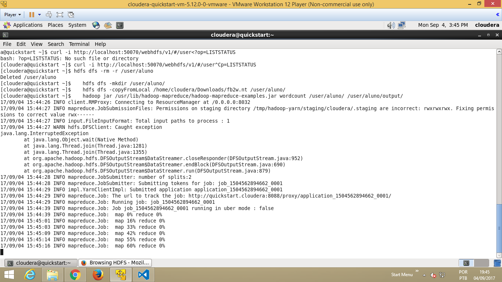

# Introdução

O MapReduce v2 utiliza o _YARN (Yet Another Resource Negotiator)_ como gerenciador de recursos. O YARN é responsável por alocar os recursos do cluster e executar os jobs MapReduce.
O YARN é composto por dois componentes principais:
- _ResourceManager_: gerencia os recursos do cluster e aloca os containers para os jobs MapReduce.
- _NodeManager_: gerencia os containers em cada nó do cluster e executa os tasks dos jobs MapReduce.
Além disso, o YARN também possui um componente chamado _ApplicationMaster_, que é responsável por gerenciar a execução de um job MapReduce específico.

## Objetivo

Neste exercício iremos executar um job MapReduce para contar palavras de um arquivo com links do Wikipedia que será carregado no HDFS.

### Tempo estimado

:hourglass_flowing_sand: 30 minutos

### Roteiro de atividades

- **A)** Prepação dos dados para execução
- **B)** Executar o programa de MapReduce
- **C)** Gerenciar jobs MapReduce em execução
- **D)**: Desafio

---

# Atividades

## Iniciar a VM

> Para importar a máquina virtual no [VirtualBox](https://www.virtualbox.org/wiki/Downloads) é necessário instalar também o pacote de extensão.
- Após instalar o VirtualBox, basta selecionar e clicar duas vezes no arquivo `cloudera-quickstart-vm-5.13.0-0-virtualbox.ovf`.
  - O processo de importação pode demorar alguns minutos, pois a máquina virtual é grande (cerca de 5 GB).

- Antes de inicializar a máquina virtual, certifique-se de ter habilitado a opção de rede `Bridged Adapter` para que a máquina virtual tenha acesso à internet e possa ser acessada pela sua máquina.
  - Clique com o botão direito do mouse na máquina virtual e selecione `Configurações` > `Rede` > `Adaptador 1` > `Conectado a` > `Placa em modo Bridge`.

- Clique em `OK` para salvar as alteraçõe e inicie a máquina virtual clicando com o botão direito do mouse e selecionando `Iniciar`.

## A) Prepação dos dados para execução

1. Num terminal linux, execute o comando para verificar se o diretório aluno já existe no HDFS
```shell
hdfs dfs -ls /user
```

> [!NOTE]
> Caso não existir, crie o diretório executando o comando (no lugar de aluno, use seu nome - se quiser)
```shell
hdfs dfs -mkdir /user/aluno/
```

2. Conceda a permissão dos diretórios do HDFS para qualquer usuário
```shell
hdfs dfs -chmod -R 777 /
```

3. Abra o navegador e realize o download da base _“Freebase/Wikidata Mappings”_, disponível [neste link](https://developers.google.com/freebase/). Salve o arquivo no diretório `/home/cloudera/Downloads`

4. Descompacte o arquivo salvo
```shell
cd /home/cloudera/Downloads
gzip -d fb2w.nt.gz
```

5. Coloque o arquivo descompactado no HDFS
```shell
hdfs dfs -copyFromLocal /home/cloudera/Downloads/fb2w.nt /user/aluno/
```

## B) Executar o programa de MapReduce

6. Execute o programa MapReduce de exemplos (`hadoop-mapreduce-examples.jar`) utilizando a função `wordcount` que conta a quantidade de palavras em um arquivo no HDFS.
```shell
hadoop jar /usr/lib/hadoop-mapreduce/hadoop-mapreduce-examples.jar wordcount /user/aluno/ /user/aluno/output/
```
> [!IMPORTANT]
> Aguarde a finalizacao do job e verifique a saida



7. Verifique se a contagem de palavras ocorreu com sucesso
```shell
hdfs dfs -ls /user/aluno/output
```

**Saída esperada**
```
Found 2 items
-rw-r--r--   1 cloudera supergroup          0 2017-09-04 15:46 /user/aluno/output/_SUCCESS
-rw-r--r--   1 cloudera supergroup  176870257 2017-09-04 15:46 /user/aluno/output/part-r-00000
```

- Execute o comando abaixo para visualizar a saída do arquivo
```shell
hdfs dfs -cat /user/aluno/output/part-r-00000 | head
hdfs dfs -cat /user/aluno/output/part-r-00000 | tail
```

8. Visualize os logs de execução do job executado pelo browser
   - No browser acesse a página do [ResourceManager](http://{ip_address}:8088)
   - Clique no ID do job executado (ex: `application_1504562894662_0001`)
   - Clique em `logs` para visualizar os logs da execução

## C) Gerenciar jobs MapReduce em execução

9. Execute novamente o job de contagem de palavras que acabamos de executar, alterando o diretório de saída para `output2`
```shell
hadoop jar /usr/lib/hadoop-mapreduce/hadoop-mapreduce-examples.jar wordcount /user/aluno/fb2w.nt /user/aluno/output2/
```

10. Enquanto o job está executando, abra outro terminal linux e execute o comando para listar os em execução
```shell
hadoop job -list
```

**Saída esperada**
```
Total jobs:1
JobId	     State	     StartTime	    UserName	       Queue	  Priority	 UsedContainers	 RsvdContainers	 UsedMem	 RsvdMem NeededMem	   AM info
job_1504554194266_0002	   RUNNING	 1504561700010	    cloudera	root.cloudera	    NORMAL	              2	              0	   3072M	      0M     3072M	http://quickstart.cloudera:8088/proxy/application_1504554194266_0002/
```

11. Em seguida, execute um kill para interromper esse job
```shell
hadoop job -kill job_1446639780394_0002
```
---
## Desafio

Já terminou o exercício? Quer um desafio maior? Então quero ver você resolver...

1. Execute mais uma vez o job MapReduce e visualize e acompanhe os logs pela interface web enquanto o job executa.

2. Análise como o arquivo fb2w ficou distribuído no HDFS acessando a página do [NameNode](http://{ip_address}:50070) por meio do browser.

3. Execute novamente o job MapReduce de contagem de palavras com um outro arquivo que você deve criar contendo pelo menos 3 linhas.
