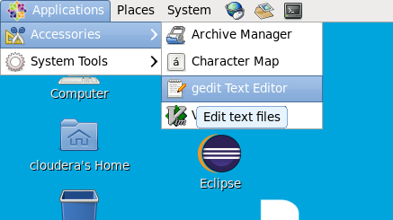
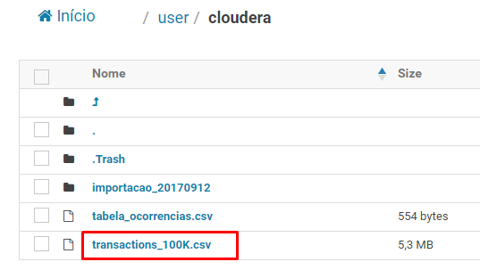
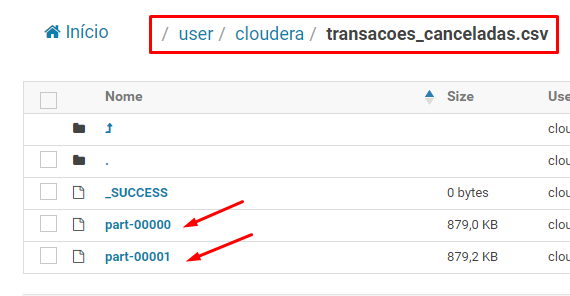
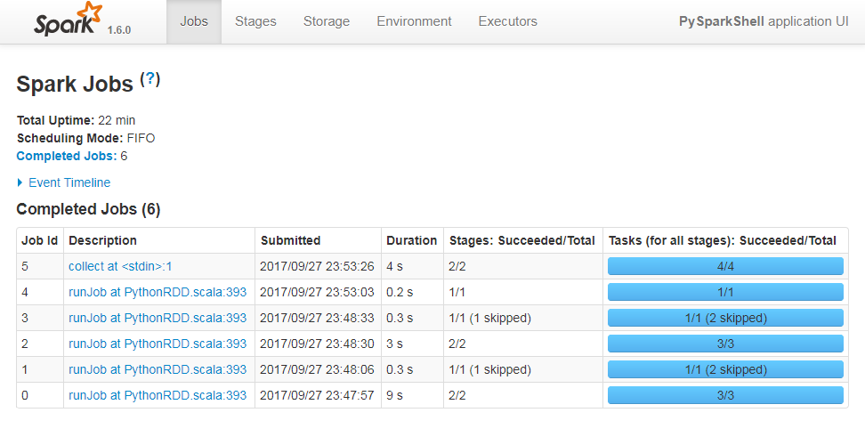
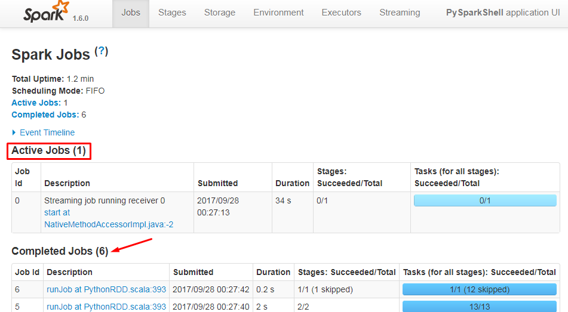

# Introdução

O Apache Spark é um framework de processamento de dados em larga escala, que permite o processamento de dados em memória e em disco. O Spark é amplamente utilizado para processamento de dados em tempo real e batch, além de suportar diversas linguagens de programação, como Scala, Java, Python e R.

Seus principais componentes são:
- **Spark Core**: o núcleo do Spark, responsável pelo gerenciamento de memória, execução de tarefas e agendamento de jobs.
- **Spark SQL**: módulo para processamento de dados estruturados e consulta a bancos de dados relacionais.
- **Spark Streaming**: módulo para processamento de dados em tempo real, permitindo o processamento de fluxos de dados contínuos.
- **MLlib**: biblioteca de aprendizado de máquina para construção de modelos preditivos.
- **GraphX**: módulo para processamento de grafos e análise de redes sociais.

Além disso, sua unidade de execução é baseada em DAG (Directed Acyclic Graph), o que permite otimizar o processamento de dados e melhorar a performance.
- **RDD (Resilient Distributed Dataset)**: a unidade fundamental de dados do Spark, que permite o processamento paralelo e tolerância a falhas. Os RDDs são imutáveis e podem ser criados a partir de dados em disco ou em memória.
- **DataFrame**: uma abstração de dados estruturados, semelhante a uma tabela em um banco de dados relacional. Os DataFrames permitem consultas SQL e operações de transformação de dados.

## Objetivo

Neste exercício iremos explorar diversas funcionalidades do Spark para processamento de dados.

### Tempo estimado

:hourglass_flowing_sand: 60 minutos

### Roteiro de atividades

- **A)** Conhecendo os consoles interativos do Spark  
- **B)** Interagindo com a API de processamento batch do Spark  
- **C)** Interagindo com a API streaming do Spark  
- **D)** Desafio

---

# Atividades

## Iniciar a VM

> Para importar a máquina virtual no [VirtualBox](https://www.virtualbox.org/wiki/Downloads) é necessário instalar também o pacote de extensão.
- Após instalar o VirtualBox, basta selecionar e clicar duas vezes no arquivo `cloudera-quickstart-vm-5.13.0-0-virtualbox.ovf`.
  - O processo de importação pode demorar alguns minutos, pois a máquina virtual é grande (cerca de 5 GB).

- Antes de inicializar a máquina virtual, certifique-se de ter habilitado a opção de rede `Bridged Adapter` para que a máquina virtual tenha acesso à internet e possa ser acessada pela sua máquina.
  - Clique com o botão direito do mouse na máquina virtual e selecione `Configurações` > `Rede` > `Adaptador 1` > `Conectado a` > `Placa em modo Bridge`.

- Clique em `OK` para salvar as alteraçõe e inicie a máquina virtual clicando com o botão direito do mouse e selecionando `Iniciar`.

## A) Conhecendo os consoles interativos do Spark

1. Inicie console `spark-shell` para scala
- Em um terminal linux, execute o comando:
    ```shell
    spark-shell
    ```

- **Saída Esperada**
    ```text
    Setting default log level to "WARN".
    To adjust logging level use sc.setLogLevel(newLevel).
    SLF4J: Class path contains multiple SLF4J bindings.
    ...
    Welcome to
        ____              __
        / __/__  ___ _____/ /__
    _\ \/ _ \/ _ `/ __/  '_/
    /___/ .__/\_,_/_/ /_/\_\   version 1.6.0
        /_/
    ...
    scala>
    ```

2. Crie um arquivo arquivo de testes
- Abra um editor de texto (gedit) e crie um arquivo com o nome `exercicio_spark.txt`
  
- Cole o conteúdo abaixo:
    ```text
    # Inicio
    Teste Spark !!!
    Teste Spark !!!
    Teste Spark !!!
    Teste Spark !!!
    Teste Spark !!!
    Teste Spark !!!
    Teste Spark !!!
    Teste Spark !!!
    Teste Spark !!!
    # Fim
    ```
- Salve o arquivo em `/home/cloudera/exercicio_spark.txt`

3. Conte as linhas do arquivo usando o _shell scala_
- No terminal aberto com o spark-shell, execute o comando abaixo
    ```scala
    val rdd = sc.textFile("file:///home/cloudera/exercicio_spark.txt")
    ```

- **Saída Esperada**
    ```text
    rdd: org.apache.spark.rdd.RDD[String] = file:///home/cloudera/exercicio_spark.txt MapPartitionsRDD[7] at textFile at <console>:27
    ```

- Execute a action para contar a quantidade de registros
    ```scala
    rdd.count()
    ```

- **Saída Esperada**
    ```text
    res1: Long = 12
    ```

- Aperte `CTRL+D` duas vezes e feche o terminal

4. Execute a mesma contagem em um terminal `pyspark`
- Em outro terminal linux, execute o comando:
    ```shell
    pyspark
    ```

- **Saída Esperada**
    ```text
    ...
    Welcome to
        ____              __
        / __/__  ___ _____/ /__
        _\ \/ _ \/ _ `/ __/  '_/
        /__ / .__/\_,_/_/ /_/\_\   version 1.6.0
        /_/


    Using Python version 2.6.6 (r266:84292, Jul 23 2015 15:22:56)
    SparkContext available as sc, HiveContext available as sqlContext.
    >>>
    ```

- Crie o RDD e faça a contagem de linhas
    ```python
    rdd = sc.textFile("file:///home/cloudera/exercicio_spark.txt")
    rdd.count()
    ```

- **Saída Esperada**
    ```
    12
    ```

## B) Interagindo com a API de processamento batch do Spark

5. Crie um arquivo com 100K transações de cartão de crédito
- Copie o conteúdo do script `live_transactions_generator.py` armazenado em `./resources/scripts` para um novo documento no gedit
- Salve o arquivo em `/home/cloudera/live_transactions_generator.py`
- Abra um novo terminal Linux e execute o comando abaixo para gerar um arquivo com 100000 transações de cartão
    ```shell
    python live_transactions_generator.py 100000 > transactions_100k.csv
    ```

6. Copie o arquivo resultante para o HDFS
- Para isso, execute o comando abaixo
    ```shell
    hdfs dfs -copyFromLocal transactions_100k.csv /user/cloudera/
    ```

- Usando a interface do HUE, navegue até browser de arquivos e verifique o que arquivo foi inserido no HDFS
  

7. Crie um RDD a partir do arquivo inserido no HDFS e filtre apenas as transações aprovadas
- No pyspark shell, execute:
    ```python
    transactions = sc.textFile("hdfs:///user/cloudera/transactions_100k.csv")
    ```

8. Conte a quantidades de transações aprovadas e canceladas usando a função `filter`
- Crie 2 novos RDD's filtrando as transações
    ```python
    aprovadas = transactions.filter(lambda l: "APROVADA" in l)
    canceladas = transactions.filter(lambda l: "CANCELADA" in l)
    ```

- Visualize o funcionamento do filtro aplicado
    ```python
    aprovadas.take(5)
    ```

- **Saída Esperada**
    ```text
    [u'2017-09-27 22:25:27,jfta0igc,Loja3,APROVADA,BRL,9178', u'2017-09-27 22:25:27,1a6o9j0h,Loja6,APROVADA,USD,1236', u'2017-09-27 22:25:27,v2nstwce,Loja2,APROVADA,BRL,8694', u'2017-09-27 22:25:27,31y6bwcr,Loja2,APROVADA,USD,7081', u'2017-09-27 22:25:27,m1w3zy8a,Loja7,APROVADA,USD,7000']
    ```

- Execute a ação de contagem de registros
    ```python
    aprovadas.count()
    canceladas.count()
    ```

- **Saída Esperada**
    ```
    33318 - Os valores são aleatórios, então a saída pode ser diferente
    ```

> [!WARNING]
> Como geramos 100K transações, o número de transações aprovadas e canceladas pode variar a cada execução do script.

9. Materialize o RDD de transações canceladas no HDFS
- Execute
    ```python
    canceladas.saveAsTextFile("/user/cloudera/transacoes_canceladas.csv")
    ```
- No navegador de arquivos do HUE, note que uma pasta é criada para conter arquivos com as linhas exportadas.
  

10. Calcule o valor transacionado por tipo de moeda
- Crie um *key-value* RDD e faça a conversão de tipo usando maps
    ```python
    kv_currency_amount = aprovadas.map(lambda l: l.split(',')).map(lambda cols: (cols[4], int(cols[5])))
    kv_currency_amount.take(10)
    ```

- **Saída Esperada**
    ```text
    [(u'BRL', 9178), (u'USD', 1236), (u'BRL', 8694), (u'USD', 7081), (u'USD', 7000), (u'USD', 1211), (u'BRL', 5438), (u'USD', 4785), (u'BRL', 6563), (u'USD', 1630)]
    ```

- Agrupe os valores por moeda e some os valores transacionados
    ```python
    kv_currency_amount.reduceByKey(lambda a, b: a + b).collect()
    ```

- **Saída Esperada**
    ```text
    [(u'BRL', 84454529), (u'USD', 83530616)]
    ```

## C) Interagindo com a API streaming do Spark

11. Reinicie o console pyspark com mais de 1 thread para que o Streaming não fique travado
- Pressione CTRL+D para fechar o console atual
- Execute o comando abaixo:
    ```shell
    pyspark --driver-cores 2
    ```

12. Crie um StreamingContext para poder usar a API do Spark Streaming
- Execute o comando a seguir para iniciar um StreamingContext com micro-batch executando em janelas de 10 em 10 segundos
    ```python
    from pyspark.streaming import StreamingContext
    ssc = StreamingContext(sc, 10)
    ```

13. Crie um *key-value* DStream para receber dados de um socket tcp e fazer agregação do valor transacionado por loja
    ```python
    live_transactions = ssc.socketTextStream("localhost", 4444)
    kv_store_amount = live_transactions.map(lambda l: l.split(',')).map(lambda cols: (cols[2], int(cols[5])))
    kv_store_amount.reduceByKey(lambda v1, v2: v1 + v2).pprint()
    ```

14. Visualize que o job streaming ainda não iniciou
- Aponte seu navegador para `localhost:4040`
- Note que ou não há jobs ou todos estão completos
  

15. Inicie o gerador de eventos
- Em um outro terminal linux, execute:
    ```shell
    while :; do python transactions_generator.py ; done | nc -lk 4444
    ```

16. Inicie o StreamingContext para iniciar o processamento
- Execute no pyspark
    ```python
    ssc.start()
    ```

- **Saída Esperada**
    ```text
    -------------------------------------------                                     
    Time: 2017-09-28 00:18:50
    -------------------------------------------
    (u'Loja5', 609128)
    (u'Loja7', 636108)
    (u'Loja1', 490032)
    (u'Loja3', 529946)
    (u'Loja4', 544275)
    (u'Loja6', 708482)
    (u'Loja2', 564100)
    ...
    -------------------------------------------                                     
    Time: 2017-09-28 00:19:00
    -------------------------------------------
    (u'Loja5', 618156)
    (u'Loja7', 717384)
    (u'Loja1', 629586)
    (u'Loja3', 606443)
    (u'Loja4', 596774)
    (u'Loja6', 614073)
    (u'Loja2', 699521)
    ```

- Visualize na interface web do Spark UI
  
> [!NOTE]
> Note que há 1 job de streaming executando e um número crescente de jobs de micro-batch completados

---
## Desafios

Quer um desafio maior?

1. Crie um *key-value* RDD que contenha o seguinte mapeamento de chave e valor
  ```
  Loja1 -> Americanas
  Loja2 -> Magazine Luíza
  Loja3 -> Ricardo Eletro
  Loja4 -> Privalie
  Loja5 -> Netshoes
  Loja6 -> Walmart
  Loja7 -> Submarino
  ```
  > [!NOTE]
  > Utilize uma operação de `join` para fornecer uma visão de saída com os nomes das lojas reais

2. Crie um script python com o conteúdo a seguir:
  ```python
  from pyspark import SparkContext
  sc = SparkContext("local[1]", "Desafio 2")
  rdd = sc.parallelize([1, 2, 3, 4, 5])
  print rdd.collect()
  ```
  e tente submetê-lo como um job com spark standalone
  > [!TIP]
  > **Dica:** O parâmetro `py-files` permite enviar arquivos python para o cluster Spark

