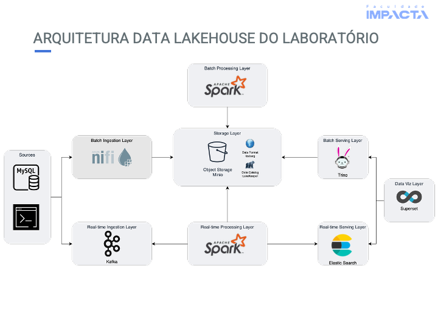

# Modern Data Stack


Bem-vindo ao laboratório de **Data Lakehouse** da Impacta! Este repositório reúne tudo o que você precisa para colocar a mão na massa e aprender, na prática, como funcionam as principais tecnologias do universo de Engenharia de Dados. Aqui, você vai experimentar desde a ingestão até a análise de dados, usando ferramentas modernas e amplamente utilizadas no mercado.

## Estrutura do Repositório

- **config**: Arquivos de configuração das tecnologias que você vai explorar nos exercícios.
- **resources**: Imagens, scripts e outros recursos essenciais para o laboratório funcionar perfeitamente.
- **volumes**: Arquivos de volumes, como configurações do Docker e outros itens necessários para rodar o ambiente.

## Tecnologias que Você Vai Usar

- **Docker**: Criação e gerenciamento dos containers das ferramentas do laboratório.
    - [Docker](https://www.docker.com/)

- **Apache Spark**: Processamento de grandes volumes de dados de forma distribuída.
    - [Apache Spark](https://spark.apache.org/docs/latest/)
- **Apache Kafka**: Streaming de dados em tempo real, essencial para pipelines modernos.
    - [Apache Kafka](https://kafka.apache.org/documentation/)
- **MiniO**: Simulação de um armazenamento de objetos compatível com o S3 da AWS.
    - [MinIO](https://min.io/docs/minio/container/index.html)
- **PagilaDB**: Base de dados de exemplo para testar e praticar consultas.
    - [PagilaDB](https://github.com/pgjdbc/pgjdbc/blob/master/README.md)
- **SuperSet**: Visualização e análise de dados de maneira interativa.
    - [Apache Superset](https://superset.apache.org/docs/intro)
- **Apache Nifi**: Ingestão, integração e movimentação de dados entre sistemas.
    - [Apache Nifi](https://nifi.apache.org/docs/nifi-docs/)
- **LakeKeeper**: Gerenciamento de metadados no formato Apache Iceberg.
    - [LakeKeeper](https://docs.lakekeeper.io/docs/latest/concepts/)
- **Trino**: Consultas SQL distribuídas em grandes volumes de dados.
    - [Trino](https://trino.io/docs/current/)
- **Elasticsearch**: Busca e análise de dados em tempo real.
    - [Elasticsearch](https://www.elastic.co/guide/en/elasticsearch/reference/current/index.html)
- **Jupyter**: Notebooks interativos para análise e experimentação.
    - [Jupyter](https://jupyter.org/documentation)

Explore, experimente e aproveite ao máximo este ambiente preparado especialmente para acelerar seu aprendizado em Engenharia de Dados!

## Execução do Ambiente
Para iniciar o ambiente do laboratório, você precisará ter o [Docker](https://www.docker.com/get-started/) instalado em sua máquina.

1. Clone este repositório:
   ```bash
   git clone
   ```

2. Navegue até o diretório do repositório:
   ```bash
   cd modern-data-stack
   ```

3. Execute o comando abaixo para iniciar os containers do Docker:
   ```bash
   bash begin-here.sh
   ```

4. Acesse as ferramentas através dos seguintes links:

| Serviço         | URL de Acesso                                    | Porta Padrão | Usuário/Senha                        |
|-----------------|--------------------------------------------------|--------------|--------------------------------------|
| MinIO           | [http://localhost:9000](http://localhost:9000)   | 9000         |None/None                             |
| MinIO Console   | [http://localhost:9001](http://localhost:9001)   | 9001         |admin/impacta2025                     |
| Kafka UI        | [http://localhost:8083](http://localhost:8083)   | 8083         |None/None                             |
| PagilaDB        | `postgresql://localhost:5432/pagila_db`          | 5432         |pagila_user/pagila_pass               |
| Superset        | [http://localhost:8088](http://localhost:8088)   | 8088         |None/None                             |
| Apache Nifi     | [https://localhost:8443](https://localhost:8443) | 8443         |admin/ctsBtRBKHRAx69EqUghvvgEvjnaLjFEB|
| LakeKeeper      | [http://localhost:8181](http://localhost:8181)   | 8181         |None/None                             |
| Trino           | [http://localhost:8085](http://localhost:8085)   | 8085         |trino/None                            |
| Jupyter         | [http://localhost:8888](http://localhost:8888)   | 8888         |None/None                             |
| Elasticsearch   | [http://localhost:9200](http://localhost:9200)   | 9200         |None/None                             |

## Como Praticar
Para começar a praticar, siga o passo a passo abaixo:
1. **Ingestão de Dados**: Utilize o Apache Nifi para criar um fluxo de dados que ingeste informações do PagilaDB e envie para o MinIO.
2. **Processamento de Dados**: Use o Apache Spark para processar os dados ingeridos e gerar tabelas em formato de Lake House.
3. **Streaming de Dados**: Configure o Apache Kafka para receber dados em tempo real.
4. **Visualização de Dados**: Utilize o Apache Superset para criar dashboards e visualizar os dados através do Trino.

## Exercícios

### Ingestão de Dados com Apache Nifi
1. Crie um fluxo no Apache Nifi para ingestão de dados do PagilaDB.

    a. Configure o `QueryDatabaseTable` para conectar ao banco do PagilaDB e extrair dados.
    - No menu superior, clique em `Add Processor` e busque por `QueryDatabaseTable`.
    - Arraste o processador para o canvas e clique duas vezes nele para configurar.
    - Na aba `Properties`, configure as seguintes propriedades:
        - `Database Connection Pooling Service`: Crie um serviço de conexão com o banco de dados.
        - Em `Add Controller Service`, selecione `DBCPConnectionPool` e configure as propriedades:
            - `Database Connection URL`: Defina a URL de conexão como `jdbc:postgresql://pagila_db:5432/pagila_db`.
            - `Database Driver Class Name`: Defina como `org.postgresql.Driver`.
            - `Database User`: Defina o usuário do banco de dados `pagila_user`.
            - `Database Password`: Defina a senha do banco de dados, por exemplo, `pagila_pass`.denar os dados.
            - Valide as configurações clicando em `Verification`.
            - Em caso de sucesso, clique em `Apply` para salvar as configurações.
        - Habilite o controller service clicando no botão ≡ e selecionando `Enable`.
    - Nas configurações do `QueryDatabaseTable`, defina as seguintes propriedades:
        - `Database Type`: Selecione `PostgreSQL`.
        - `Table Name`: Defina como `customer`.
        - `Maximum-value Columns`: Defina como `last_update` para controle de incremental.
        - `Initial Load Strategy`: Selecione `Start at Current Maximum Values` para carregar controle de incremental.
    - Clique em `Apply` para salvar as configurações.

    b. Use o `ConvertAvroToParquet` para converter os dados para o formato Parquet.
    - Adicione um novo processador `ConvertAvroToParquet` ao canvas.
    - Conecte o `QueryDatabaseTable` ao `ConvertAvroToParquet`.
    - Clique duas vezes no processador `ConvertAvroToParquet` para configurar.
    - Na aba `Properties`, configure as seguintes propriedades:
        - `Compression Type`: Defina como `SNAPPY` para compressão dos dados.
        - `Writer Version`: Defina como `PARQUET_2_0`.
    - Clique em `Apply` para salvar as configurações.
    
    c. Use o `PutS3Object` para enviar os dados para o MinIO.
    - Adicione um novo processador `PutS3Object` ao canvas.
    - Em propriedades, adicione um novo `AWS Credentials Provider Service` e configure as credenciais do MinIO no serviço:
        - `Access Key ID`: Defina como `4PRJYFLGzQYTnOJGH1gA`.
        - `Secret Access Key`: Defina como `ovBkCsqh2cXNkyoteCzQMV5JWCUk5tHfsG1GwYbD`.
        - Habilite o serviço clicando no botão ≡ e selecionando `Enable`.
    - Adicione os parametros de configuração do bucket no MinIO:
        - `Bucket`: Defina como `raw`.
        - `Object Key`: Defina como `pagila_db/customer/${filename}`.
        - `Endpoint Override URL`: Defina como `http://minio:9000`.

    d. Conecte o `ConvertAvroToParquet` ao `PutS3Object`.
    e. Altere as `Relationships` do `ConvertAvroToParquet` `PutS3Object` para `success` e `failure`.
    f. Execute o fluxo clicando no botão de "play" no canto superior esquerdo do Apache Nifi.
    g. Verifique se os dados foram enviados corretamente para o MinIO acessando o console em [http://localhost:9001](http://localhost:9001).

- Lista de Tabelas do PagilaDB:

    Schema |       Name       |       Type        |
    -------|------------------|-------------------|
    public | actor            | table             |
    public | address          | table             |
    public | category         | table             |
    public | city             | table             |
    public | country          | table             |
    public | customer         | table             |
    public | film             | table             |
    public | film_actor       | table             |
    public | film_category    | table             |
    public | inventory        | table             |
    public | language         | table             |
    public | payment          | partitioned table |
    public | payment_p2022_01 | table             |
    public | payment_p2022_02 | table             |
    public | payment_p2022_03 | table             |
    public | payment_p2022_04 | table             |
    public | payment_p2022_05 | table             |
    public | payment_p2022_06 | table             |
    public | payment_p2022_07 | table             |
    public | rental           | table             |
    public | staff            | table             |
    public | store            | table             |

2. Extraíndo todas as tabelas do PagilaDB.
    a. Adicione um novo processador `ListDatabaseTables` ao canvas, para listar todas as tabelas do PagilaDB.
    - Configure o processador `ListDatabaseTables` com as seguintes propriedades:
        - `Database Connection Pooling Service`: Selecione o serviço de conexão criado anteriormente.
        - `Schema Pattern`: public
        - `Table Name Pattern`: `%` (para listar todas as tabelas).
    b. Adicione um novo processador `ExecuteSQL` ao canvas, para executar a consulta SQL de extração dos dados.
    - Conecte o `ListDatabaseTables` ao `ExecuteSQL`.
    - Configure o processador `ExecuteSQL` com as seguintes propriedades:
        - `Database Connection Pooling Service`: Selecione o serviço de conexão criado anteriormente.
        - `SQL select query`: Defina como `SELECT * FROM ${db.table.name}` para extrair todos os dados da tabela.
    c. Conecte o `ExecuteSQL` ao `ConvertAvroToParquet` para converter os dados extraídos.
    d. Conecte o `ConvertAvroToParquet` ao `PutS3Object` para enviar os dados convertidos para o MinIO.
    e. Modifique o `Object Key` do `PutS3Object` para incluir o nome da tabela:
        - `Object Key`: Defina como `pagila_db/${db.table.name}/${filename}`.
    f. Execute o fluxo clicando no botão de "play".
    g. Verifique se os dados foram enviados corretamente para o MinIO acessando o console em [http://localhost:9001](http://localhost:9001).

### Processamento de Dados com Apache Spark
1. Criando um job no Apache Spark para processar os dados do MinIO e gerar tabelas em formato de Lake House.
    - Abra o Notebook Jupyter em [http://localhost:8888](http://localhost:8888) e selecione o notebook `spark_processing.ipynb`.
    - No notebook, você encontrará células de código já preparadas para ler os dados do MinIO, processá-los e salvá-los no formato Iceberg.

### Conectando o Trino ao SuperSet
1. Abra o Apache Superset em [http://localhost:8088](http://localhost:8088).
2. Crie uma nova fonte de dados conectando ao Trino:
    - Vá para `Data` > `Databases` > `+ Database`.
    - Selecione `Trino` como o tipo de banco de dados.
    - Preencha as informações de conexão:
        - `SQLAlchemy URI`: `trino://admin@trino:8080/trusted`

### Explorando Dados com Apache Superset
1. No Apache Superset, vá em `SQL` > `SQL Lab` e crie uma nova consulta SQL.
    a. Filmes Mais Alugados
    ```sql
    SELECT
        f.title AS titulo
        , COUNT(r.rental_id) AS total_alugueis
    FROM rental r
    JOIN inventory i ON r.inventory_id = i.inventory_id
    JOIN film f ON i.film_id = f.film_id
    GROUP BY f.title
    ORDER BY total_alugueis DESC
    LIMIT 10;
    ```
    
    b. Receita por Categoria de Filme
    ```sql
    SELECT
        c.name AS categoria
        , SUM(CAST(p.amount AS DOUBLE)) AS receita_total
    FROM payments p
    JOIN rental r ON p.rental_id = r.rental_id
    JOIN inventory i ON r.inventory_id = i.inventory_id
    JOIN film f ON i.film_id = f.film_id
    JOIN film_category fc ON f.film_id = fc.film_id
    JOIN category c ON fc.category_id = c.category_id
    GROUP BY c.name
    ORDER BY receita_total DESC;
    ```

    c. Clientes com Maior Gasto
    ```sql
    SELECT
        c.first_name || ' ' || c.last_name AS cliente
        , SUM(CAST(p.amount AS DOUBLE)) AS total_gasto
    FROM customer c
    JOIN payments p ON c.customer_id = p.customer_id
    GROUP BY 1
    ORDER BY total_gasto DESC
    LIMIT 10;
    ```

    d. Aluguéis por Mês
    ```sql
    SELECT
        DATE_FORMAT(date_parse(rental_date, '%Y-%m-%d %H:%i:%s.%f'), '%Y-%m') AS mes
        , COUNT(*) AS total_alugueis
    FROM rental r
    GROUP BY 1
    ORDER BY 1;
    ```

    e. Tempo Médio de Aluguel por Categoria
    ```sql
        SELECT
            c.name AS categoria,
            AVG(DATE_DIFF(
                'day'
                , date_parse(r.rental_date, '%Y-%m-%d %H:%i:%s.%f')
                , date_parse(r.return_date, '%Y-%m-%d %H:%i:%s.%f')
            )) AS tempo_medio_dias
        FROM rental r
        JOIN inventory i ON r.inventory_id = i.inventory_id
        JOIN film f ON i.film_id = f.film_id
        JOIN film_category fc ON f.film_id = fc.film_id
        JOIN category c ON fc.category_id = c.category_id
        WHERE r.return_date IS NOT NULL
        GROUP BY c.name
        ORDER BY tempo_medio_dias DESC;
    ```

### Stream de Dados com Apache Kafka
1. Configure o Apache Kafka para receber dados em tempo real.
    - Abra o Kafka UI em [http://localhost:8083](http://localhost:8083).
    - Crie um novo tópico chamado `popular_critics` para receber os dados de avaliação de filmes, com as seguintes configurações:
        - **Topic Name**: popular_critics
        - **Partitions**: 1 (para simplificar o ambiente de desenvolvimento)
        - **Cleanup Policy**: `Delete` (para manter apenas a última mensagem por chave)
        > [!NOTE]
        > Tipos de Cleanup Policy:
        > - `Delete`: mensagens são removidas após o período de retenção.
        > - `Compact`: mantém apenas a última mensagem por chave, útil para dados de estado.
        > - `Compact, Delete`: combina as duas políticas, mantendo a última mensagem por chave e removendo mensagens antigas após o período de retenção.
        - **Replication Factor**: 1 (para simplificar o ambiente de desenvolvimento)
        - **Retention**: 12 horas (para econômica de armazenamento)
    

2. Crie uma mensagem de exemplo para enviar dados para o tópico `popular_critics`.
    - No Kafka UI, vá para `Topics` > `popular_critics` > `Produce Message`.
    - Envie o payload de exemplo abaixo no campo de `Value`:
    ```json
    {
        "name": "John Farnsworth",
        "film": "Agent Truman",
        "rating": 9,
        "review": "A mind-bending thriller that keeps you on the edge of your seat."
    }
    ```

3. Verifique se a mensagem foi recebida corretamente no tópico `popular_critics`.
    - Vá para `Topics` > `popular_critics` > `Messages`.
    - Você deve ver a mensagem que acabou de enviar.

### Produzindo e Consumindo Dados com Apache Kafka
1. Criando um `producer` e `consumer` para o tópico `popular_critics`.
    - Abra o Jupyter Notebook em [http://localhost:8888](http://localhost:8888) e selecione o notebook `kafka_producer.ipynb`.
    - No notebook, você encontrará células de código já preparadas para produzir e consumir mensagens do tópico `popular_critics`.